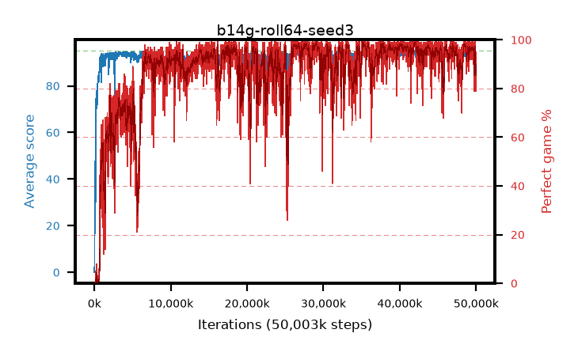

# b14g-roll64-seed3

step **50,003,968** · 6104 evals · trailing **93.62** · peak **94.61** @35,282,944 · sef **81.0** · best30 **98.7** @42,082,304

## Config

| | |
|---|---|
| algo | ppo |
| collect_envs | 128 |
| discount | 0.99 |
| eval_interval | 8192 |
| eval_queue | True |
| eval_queue_depth | 16 |
| eval_workers | 8 |
| fc_layers | (320,) |
| graph_eval_episodes | 100 |
| max_steps | 50003968 |
| min_checkpoint_score | 40.0 |
| ppo_adam_epsilon | 1e-07 |
| ppo_anneal_fraction | 1.0 |
| ppo_clip | 0.2 |
| ppo_clip_final | None |
| ppo_entropy_coef | 0.01 |
| ppo_entropy_coef_final | None |
| ppo_epochs | 4 |
| ppo_gae_lambda | 0.99 |
| ppo_gradient_clipping | 0.5 |
| ppo_horizon | 50.3 |
| ppo_learning_rate | 0.0003 |
| ppo_learning_rate_final | None |
| ppo_minibatch | 256 |
| ppo_normalize_adv | True |
| ppo_rollout | 64 |
| ppo_target_kl | 0.0 |
| ppo_transitions_per_rollout | 8192 |
| ppo_value_loss | huber |
| ppo_vf_coef | 0.5 |
| seed | 3 |
| torch_threads | 1 |

## Evals

| step | avg score | trailing avg | min score | max score | avg reward | perfect % | epsilon |
|---|---|---|---|---|---|---|---|
| 8192 | 0.04 | 0.04 | 0.0 | 1.0 | -0.505 | 0.0 |  |
| 16384 | 1.1 | 0.57 | 0.0 | 3.0 | 0.555 | 0.0 |  |
| 24576 | 8.62 | 6.84 | 2.0 | 24.0 | 5.825 | 0.0 |  |
| ... | ... | ... | ... | ... | ... | ... | ... |
| 49913856 | 92.11 | 93.75 | 70.0 | 95.0 | 174.195 | 83.0 |  |
| 49922048 | 92.15 | 93.64 | 55.0 | 95.0 | 170.255 | 79.0 |  |
| 49930240 | 92.31 | 93.71 | 58.0 | 95.0 | 176.385 | 85.0 |  |
| 49938432 | 93.06 | 93.53 | 63.0 | 95.0 | 179.125 | 87.0 |  |
| 49946624 | 92.95 | 93.61 | 70.0 | 95.0 | 178.02 | 86.0 |  |
| 49954816 | 94.14 | 93.56 | 63.0 | 95.0 | 188.165 | 95.0 |  |
| 49963008 | 90.84 | 93.54 | 14.0 | 95.0 | 172.925 | 83.0 |  |
| 49971200 | 90.82 | 93.59 | 62.0 | 95.0 | 168.925 | 79.0 |  |
| 49979392 | 92.58 | 93.6 | 60.0 | 95.0 | 177.65 | 86.0 |  |
| 49987584 | 93.12 | 93.58 | 62.0 | 95.0 | 183.165 | 91.0 |  |
| 49995776 | 93.25 | 93.62 | 60.0 | 95.0 | 183.295 | 91.0 |  |
| 50003968 | 92.55 | 93.62 | 56.0 | 95.0 | 181.6 | 90.0 |  |
