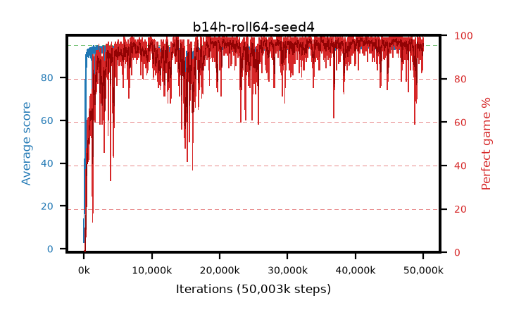

# b14h-roll64-seed4

step **50,003,968** · 6104 evals · trailing **94.04** · peak **94.7** @40,861,696 · sef **91.3** · best30 **98.1** @40,894,464

## Config

| | |
|---|---|
| algo | ppo |
| collect_envs | 128 |
| discount | 0.99 |
| eval_interval | 8192 |
| eval_queue | True |
| eval_queue_depth | 16 |
| eval_workers | 8 |
| fc_layers | (320,) |
| graph_eval_episodes | 100 |
| max_steps | 50003968 |
| min_checkpoint_score | 40.0 |
| ppo_adam_epsilon | 1e-07 |
| ppo_anneal_fraction | 1.0 |
| ppo_clip | 0.2 |
| ppo_clip_final | None |
| ppo_entropy_coef | 0.01 |
| ppo_entropy_coef_final | None |
| ppo_epochs | 4 |
| ppo_gae_lambda | 0.99 |
| ppo_gradient_clipping | 0.5 |
| ppo_horizon | 50.3 |
| ppo_learning_rate | 0.0003 |
| ppo_learning_rate_final | None |
| ppo_minibatch | 256 |
| ppo_normalize_adv | True |
| ppo_rollout | 64 |
| ppo_target_kl | 0.0 |
| ppo_transitions_per_rollout | 8192 |
| ppo_value_loss | huber |
| ppo_vf_coef | 0.5 |
| seed | 4 |
| torch_threads | 1 |

## Evals

| step | avg score | trailing avg | min score | max score | avg reward | perfect % | epsilon |
|---|---|---|---|---|---|---|---|
| 8192 | 2.97 | 2.97 | 0.0 | 13.0 | -0.185 | 0.0 |  |
| 16384 | 13.99 | 8.48 | 2.0 | 39.0 | 8.99 | 0.0 |  |
| 24576 | 12.98 | 9.98 | 2.0 | 33.0 | 7.98 | 0.0 |  |
| ... | ... | ... | ... | ... | ... | ... | ... |
| 49913856 | 94.16 | 94.13 | 70.0 | 95.0 | 188.185 | 95.0 |  |
| 49922048 | 95.0 | 94.12 | 95.0 | 95.0 | 194.0 | 100.0 |  |
| 49930240 | 94.09 | 94.05 | 59.0 | 95.0 | 188.115 | 95.0 |  |
| 49938432 | 92.96 | 93.96 | 24.0 | 95.0 | 184.905 | 93.0 |  |
| 49946624 | 93.43 | 94.03 | 18.0 | 95.0 | 186.415 | 94.0 |  |
| 49954816 | 94.21 | 94.02 | 59.0 | 95.0 | 190.225 | 97.0 |  |
| 49963008 | 94.39 | 94.03 | 34.0 | 95.0 | 192.35 | 99.0 |  |
| 49971200 | 93.86 | 94.02 | 58.0 | 95.0 | 187.885 | 95.0 |  |
| 49979392 | 94.86 | 93.97 | 84.0 | 95.0 | 191.87 | 98.0 |  |
| 49987584 | 94.23 | 94.11 | 55.0 | 95.0 | 191.24 | 98.0 |  |
| 49995776 | 93.66 | 94.0 | 57.0 | 95.0 | 185.695 | 93.0 |  |
| 50003968 | 94.44 | 94.04 | 70.0 | 95.0 | 190.455 | 97.0 |  |
