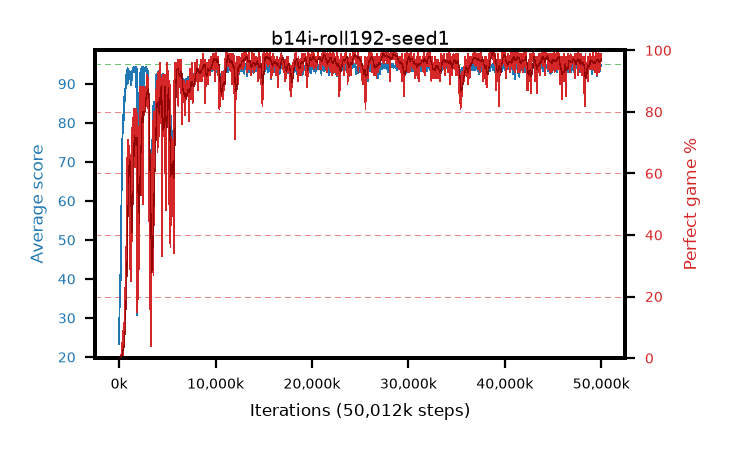

# b14i-roll192-seed1

step **50,012,160** · 2035 evals · trailing **94.31** · peak **94.67** @27,598,848 · sef **91.8** · best30 **98.3** @27,795,456

## Config

| | |
|---|---|
| algo | ppo |
| collect_envs | 128 |
| discount | 0.99 |
| eval_interval | 24576 |
| eval_queue | True |
| eval_queue_depth | 16 |
| eval_workers | 8 |
| fc_layers | (320,) |
| graph_eval_episodes | 100 |
| max_steps | 50003968 |
| min_checkpoint_score | 40.0 |
| ppo_adam_epsilon | 1e-07 |
| ppo_anneal_fraction | 1.0 |
| ppo_clip | 0.2 |
| ppo_clip_final | None |
| ppo_entropy_coef | 0.01 |
| ppo_entropy_coef_final | None |
| ppo_epochs | 4 |
| ppo_gae_lambda | 0.99 |
| ppo_gradient_clipping | 0.5 |
| ppo_horizon | 50.3 |
| ppo_learning_rate | 0.0003 |
| ppo_learning_rate_final | None |
| ppo_minibatch | 256 |
| ppo_normalize_adv | True |
| ppo_rollout | 192 |
| ppo_target_kl | 0.0 |
| ppo_transitions_per_rollout | 24576 |
| ppo_value_loss | huber |
| ppo_vf_coef | 0.5 |
| seed | 1 |
| torch_threads | 1 |

## Evals

| step | avg score | trailing avg | min score | max score | avg reward | perfect % | epsilon |
|---|---|---|---|---|---|---|---|
| 24576 | 23.31 | 23.31 | 6.0 | 42.0 | 18.31 | 0.0 |  |
| 49152 | 40.96 | 32.6 | 2.0 | 86.0 | 36.095 | 0.0 |  |
| 73728 | 32.77 | 28.04 | 8.0 | 63.0 | 27.77 | 0.0 |  |
| ... | ... | ... | ... | ... | ... | ... | ... |
| 49741824 | 94.1 | 94.3 | 77.0 | 95.0 | 186.135 | 93.0 |  |
| 49766400 | 93.31 | 94.24 | 24.0 | 95.0 | 187.335 | 95.0 |  |
| 49790976 | 94.86 | 94.25 | 84.0 | 95.0 | 191.87 | 98.0 |  |
| 49815552 | 94.65 | 94.18 | 69.0 | 95.0 | 190.62 | 97.0 |  |
| 49840128 | 93.29 | 94.24 | 10.0 | 95.0 | 186.32 | 94.0 |  |
| 49864704 | 94.28 | 94.25 | 26.0 | 95.0 | 191.29 | 98.0 |  |
| 49889280 | 94.98 | 94.35 | 93.0 | 95.0 | 192.985 | 99.0 |  |
| 49913856 | 93.68 | 94.35 | 60.0 | 95.0 | 186.665 | 94.0 |  |
| 49938432 | 94.7 | 94.36 | 65.0 | 95.0 | 192.705 | 99.0 |  |
| 49963008 | 94.78 | 94.35 | 80.0 | 95.0 | 190.795 | 97.0 |  |
| 49987584 | 94.67 | 94.29 | 62.0 | 95.0 | 192.63 | 99.0 |  |
| 50012160 | 94.68 | 94.31 | 71.0 | 95.0 | 191.69 | 98.0 |  |
