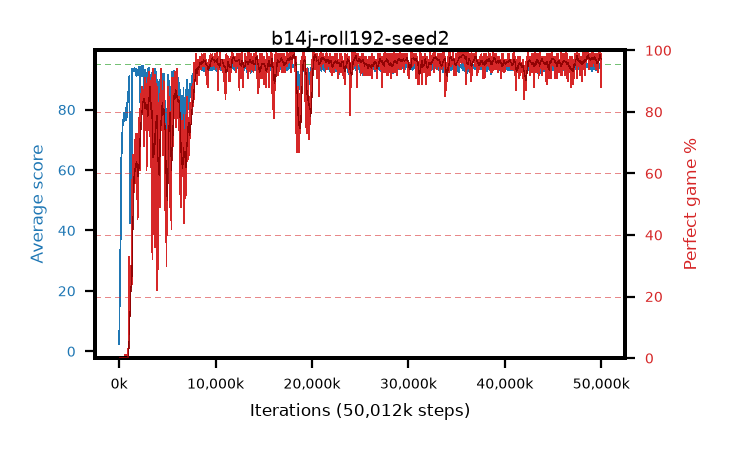

# b14j-roll192-seed2

step **50,012,160** · 2035 evals · trailing **94.33** · peak **94.46** @48,758,784 · sef **88.6** · best30 **98.1** @35,831,808

## Config

| | |
|---|---|
| algo | ppo |
| collect_envs | 128 |
| discount | 0.99 |
| eval_interval | 24576 |
| eval_queue | True |
| eval_queue_depth | 16 |
| eval_workers | 8 |
| fc_layers | (320,) |
| graph_eval_episodes | 100 |
| max_steps | 50003968 |
| min_checkpoint_score | 40.0 |
| ppo_adam_epsilon | 1e-07 |
| ppo_anneal_fraction | 1.0 |
| ppo_clip | 0.2 |
| ppo_clip_final | None |
| ppo_entropy_coef | 0.01 |
| ppo_entropy_coef_final | None |
| ppo_epochs | 4 |
| ppo_gae_lambda | 0.99 |
| ppo_gradient_clipping | 0.5 |
| ppo_horizon | 50.3 |
| ppo_learning_rate | 0.0003 |
| ppo_learning_rate_final | None |
| ppo_minibatch | 256 |
| ppo_normalize_adv | True |
| ppo_rollout | 192 |
| ppo_target_kl | 0.0 |
| ppo_transitions_per_rollout | 24576 |
| ppo_value_loss | huber |
| ppo_vf_coef | 0.5 |
| seed | 2 |
| torch_threads | 1 |

## Evals

| step | avg score | trailing avg | min score | max score | avg reward | perfect % | epsilon |
|---|---|---|---|---|---|---|---|
| 24576 | 2.39 | 2.39 | 1.0 | 7.0 | -0.63 | 0.0 |  |
| 49152 | 13.56 | 7.98 | 4.0 | 30.0 | 8.605 | 0.0 |  |
| 73728 | 24.84 | 13.6 | 2.0 | 55.0 | 19.885 | 0.0 |  |
| ... | ... | ... | ... | ... | ... | ... | ... |
| 49741824 | 94.76 | 94.31 | 76.0 | 95.0 | 191.77 | 98.0 |  |
| 49766400 | 94.75 | 94.24 | 70.0 | 95.0 | 192.755 | 99.0 |  |
| 49790976 | 94.66 | 94.31 | 72.0 | 95.0 | 191.67 | 98.0 |  |
| 49815552 | 95.0 | 94.26 | 95.0 | 95.0 | 194.0 | 100.0 |  |
| 49840128 | 94.74 | 94.19 | 69.0 | 95.0 | 192.7 | 99.0 |  |
| 49864704 | 95.0 | 94.32 | 95.0 | 95.0 | 194.0 | 100.0 |  |
| 49889280 | 93.87 | 94.32 | 11.0 | 95.0 | 189.84 | 97.0 |  |
| 49913856 | 94.86 | 94.32 | 84.0 | 95.0 | 191.87 | 98.0 |  |
| 49938432 | 94.63 | 94.34 | 80.0 | 95.0 | 189.65 | 96.0 |  |
| 49963008 | 92.99 | 94.3 | 9.0 | 95.0 | 179.96 | 88.0 |  |
| 49987584 | 94.85 | 94.31 | 80.0 | 95.0 | 192.855 | 99.0 |  |
| 50012160 | 94.59 | 94.33 | 69.0 | 95.0 | 190.56 | 97.0 |  |
