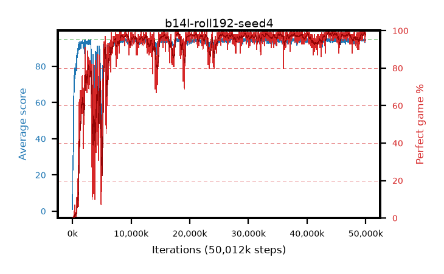

# b14l-roll192-seed4

step **50,012,160** · 2035 evals · trailing **94.59** · peak **94.65** @49,717,248 · sef **89.0** · best30 **98.5** @43,892,736

## Config

| | |
|---|---|
| algo | ppo |
| collect_envs | 128 |
| discount | 0.99 |
| eval_interval | 24576 |
| eval_queue | True |
| eval_queue_depth | 16 |
| eval_workers | 8 |
| fc_layers | (320,) |
| graph_eval_episodes | 100 |
| max_steps | 50003968 |
| min_checkpoint_score | 40.0 |
| ppo_adam_epsilon | 1e-07 |
| ppo_anneal_fraction | 1.0 |
| ppo_clip | 0.2 |
| ppo_clip_final | None |
| ppo_entropy_coef | 0.01 |
| ppo_entropy_coef_final | None |
| ppo_epochs | 4 |
| ppo_gae_lambda | 0.99 |
| ppo_gradient_clipping | 0.5 |
| ppo_horizon | 50.3 |
| ppo_learning_rate | 0.0003 |
| ppo_learning_rate_final | None |
| ppo_minibatch | 256 |
| ppo_normalize_adv | True |
| ppo_rollout | 192 |
| ppo_target_kl | 0.0 |
| ppo_transitions_per_rollout | 24576 |
| ppo_value_loss | huber |
| ppo_vf_coef | 0.5 |
| seed | 4 |
| torch_threads | 1 |

## Evals

| step | avg score | trailing avg | min score | max score | avg reward | perfect % | epsilon |
|---|---|---|---|---|---|---|---|
| 24576 | 0.91 | 0.91 | 0.0 | 4.0 | -4.0 | 0.0 |  |
| 49152 | 22.3 | 11.61 | 5.0 | 42.0 | 17.39 | 0.0 |  |
| 73728 | 24.75 | 15.99 | 5.0 | 46.0 | 19.75 | 0.0 |  |
| ... | ... | ... | ... | ... | ... | ... | ... |
| 49741824 | 94.96 | 94.64 | 91.0 | 95.0 | 192.965 | 99.0 |  |
| 49766400 | 94.75 | 94.61 | 70.0 | 95.0 | 192.755 | 99.0 |  |
| 49790976 | 94.82 | 94.64 | 77.0 | 95.0 | 192.825 | 99.0 |  |
| 49815552 | 94.7 | 94.65 | 80.0 | 95.0 | 191.71 | 98.0 |  |
| 49840128 | 93.84 | 94.62 | 44.0 | 95.0 | 186.825 | 94.0 |  |
| 49864704 | 93.13 | 94.57 | 22.0 | 95.0 | 189.1 | 97.0 |  |
| 49889280 | 95.0 | 94.58 | 95.0 | 95.0 | 194.0 | 100.0 |  |
| 49913856 | 94.86 | 94.59 | 81.0 | 95.0 | 192.865 | 99.0 |  |
| 49938432 | 94.76 | 94.61 | 84.0 | 95.0 | 190.775 | 97.0 |  |
| 49963008 | 94.85 | 94.59 | 84.0 | 95.0 | 191.86 | 98.0 |  |
| 49987584 | 94.95 | 94.62 | 90.0 | 95.0 | 192.955 | 99.0 |  |
| 50012160 | 94.59 | 94.59 | 63.0 | 95.0 | 191.6 | 98.0 |  |
