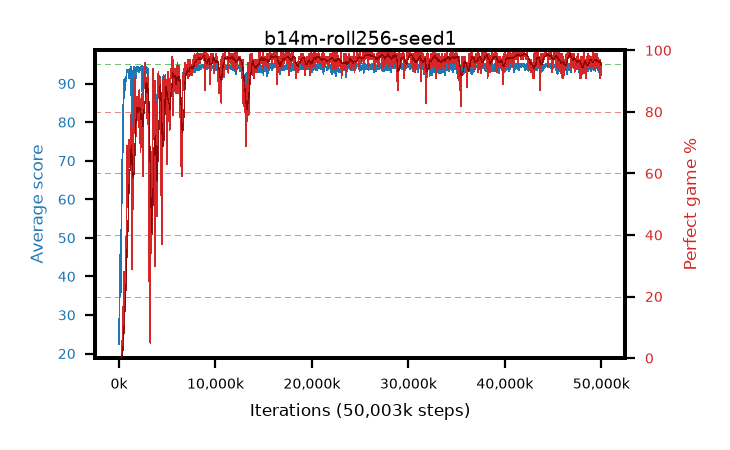

# b14m-roll256-seed1

step **50,003,968** · 1526 evals · trailing **94.1** · peak **94.58** @44,662,784 · sef **93.1** · best30 **98.6** @42,008,576

## Config

| | |
|---|---|
| algo | ppo |
| collect_envs | 128 |
| discount | 0.99 |
| eval_interval | 32768 |
| eval_queue | True |
| eval_queue_depth | 16 |
| eval_workers | 8 |
| fc_layers | (320,) |
| graph_eval_episodes | 100 |
| max_steps | 50003968 |
| min_checkpoint_score | 40.0 |
| ppo_adam_epsilon | 1e-07 |
| ppo_anneal_fraction | 1.0 |
| ppo_clip | 0.2 |
| ppo_clip_final | None |
| ppo_entropy_coef | 0.01 |
| ppo_entropy_coef_final | None |
| ppo_epochs | 4 |
| ppo_gae_lambda | 0.99 |
| ppo_gradient_clipping | 0.5 |
| ppo_horizon | 50.3 |
| ppo_learning_rate | 0.0003 |
| ppo_learning_rate_final | None |
| ppo_minibatch | 256 |
| ppo_normalize_adv | True |
| ppo_rollout | 256 |
| ppo_target_kl | 0.0 |
| ppo_transitions_per_rollout | 32768 |
| ppo_value_loss | huber |
| ppo_vf_coef | 0.5 |
| seed | 1 |
| torch_threads | 1 |

## Evals

| step | avg score | trailing avg | min score | max score | avg reward | perfect % | epsilon |
|---|---|---|---|---|---|---|---|
| 32768 | 22.45 | 22.45 | 1.0 | 43.0 | 18.44 | 0.0 |  |
| 65536 | 45.55 | 35.68 | 8.0 | 87.0 | 40.91 | 0.0 |  |
| 98304 | 39.81 | 31.13 | 9.0 | 71.0 | 34.855 | 0.0 |  |
| ... | ... | ... | ... | ... | ... | ... | ... |
| 49643520 | 93.43 | 94.05 | 26.0 | 95.0 | 186.37 | 94.0 |  |
| 49676288 | 93.89 | 94.06 | 46.0 | 95.0 | 189.86 | 97.0 |  |
| 49709056 | 94.27 | 94.04 | 61.0 | 95.0 | 189.29 | 96.0 |  |
| 49741824 | 93.02 | 94.16 | 22.0 | 95.0 | 186.05 | 94.0 |  |
| 49774592 | 93.97 | 94.2 | 24.0 | 95.0 | 189.94 | 97.0 |  |
| 49807360 | 93.58 | 94.14 | 12.0 | 95.0 | 188.6 | 96.0 |  |
| 49840128 | 94.05 | 94.19 | 30.0 | 95.0 | 190.065 | 97.0 |  |
| 49872896 | 93.81 | 94.07 | 24.0 | 95.0 | 187.79 | 95.0 |  |
| 49905664 | 93.32 | 94.09 | 20.0 | 95.0 | 183.365 | 91.0 |  |
| 49938432 | 94.46 | 94.06 | 70.0 | 95.0 | 189.48 | 96.0 |  |
| 49971200 | 93.97 | 94.04 | 20.0 | 95.0 | 187.95 | 95.0 |  |
| 50003968 | 92.3 | 94.1 | 24.0 | 95.0 | 185.33 | 94.0 |  |
