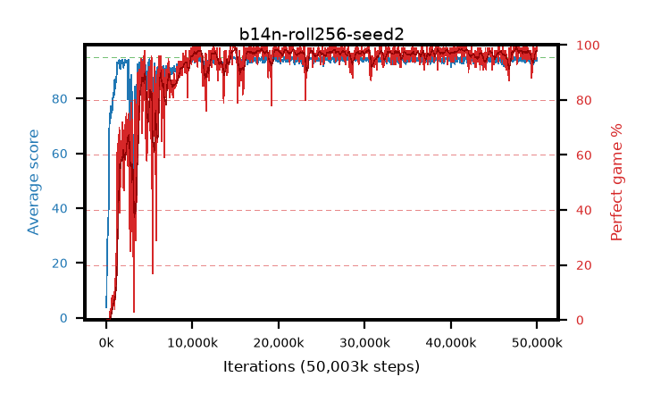

# b14n-roll256-seed2

step **50,003,968** · 1526 evals · trailing **93.96** · peak **94.55** @15,106,048 · sef **90.1** · best30 **98.2** @41,811,968

## Config

| | |
|---|---|
| algo | ppo |
| collect_envs | 128 |
| discount | 0.99 |
| eval_interval | 32768 |
| eval_queue | True |
| eval_queue_depth | 16 |
| eval_workers | 8 |
| fc_layers | (320,) |
| graph_eval_episodes | 100 |
| max_steps | 50003968 |
| min_checkpoint_score | 40.0 |
| ppo_adam_epsilon | 1e-07 |
| ppo_anneal_fraction | 1.0 |
| ppo_clip | 0.2 |
| ppo_clip_final | None |
| ppo_entropy_coef | 0.01 |
| ppo_entropy_coef_final | None |
| ppo_epochs | 4 |
| ppo_gae_lambda | 0.99 |
| ppo_gradient_clipping | 0.5 |
| ppo_horizon | 50.3 |
| ppo_learning_rate | 0.0003 |
| ppo_learning_rate_final | None |
| ppo_minibatch | 256 |
| ppo_normalize_adv | True |
| ppo_rollout | 256 |
| ppo_target_kl | 0.0 |
| ppo_transitions_per_rollout | 32768 |
| ppo_value_loss | huber |
| ppo_vf_coef | 0.5 |
| seed | 2 |
| torch_threads | 1 |

## Evals

| step | avg score | trailing avg | min score | max score | avg reward | perfect % | epsilon |
|---|---|---|---|---|---|---|---|
| 32768 | 3.77 | 3.77 | 1.0 | 10.0 | -0.915 | 0.0 |  |
| 65536 | 17.45 | 15.4 | 4.0 | 38.0 | 12.495 | 0.0 |  |
| 98304 | 24.98 | 14.38 | 7.0 | 43.0 | 19.98 | 0.0 |  |
| ... | ... | ... | ... | ... | ... | ... | ... |
| 49643520 | 93.97 | 94.02 | 30.0 | 95.0 | 190.935 | 98.0 |  |
| 49676288 | 93.17 | 94.23 | 4.0 | 95.0 | 189.14 | 97.0 |  |
| 49709056 | 94.45 | 94.24 | 40.0 | 95.0 | 192.41 | 99.0 |  |
| 49741824 | 94.2 | 94.16 | 63.0 | 95.0 | 188.225 | 95.0 |  |
| 49774592 | 93.94 | 94.09 | 28.0 | 95.0 | 189.91 | 97.0 |  |
| 49807360 | 94.74 | 94.05 | 69.0 | 95.0 | 192.745 | 99.0 |  |
| 49840128 | 94.62 | 94.04 | 60.0 | 95.0 | 191.63 | 98.0 |  |
| 49872896 | 94.81 | 94.05 | 76.0 | 95.0 | 192.815 | 99.0 |  |
| 49905664 | 93.71 | 94.01 | 36.0 | 95.0 | 187.69 | 95.0 |  |
| 49938432 | 95.0 | 93.98 | 95.0 | 95.0 | 194.0 | 100.0 |  |
| 49971200 | 94.74 | 94.1 | 69.0 | 95.0 | 192.745 | 99.0 |  |
| 50003968 | 93.68 | 93.96 | 12.0 | 95.0 | 190.6 | 98.0 |  |
