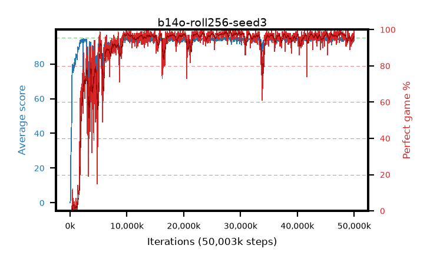

# b14o-roll256-seed3

step **50,003,968** · 1526 evals · trailing **93.92** · peak **94.44** @27,721,728 · sef **90.2** · best30 **98.1** @27,623,424

## Config

| | |
|---|---|
| algo | ppo |
| collect_envs | 128 |
| discount | 0.99 |
| eval_interval | 32768 |
| eval_queue | True |
| eval_queue_depth | 16 |
| eval_workers | 8 |
| fc_layers | (320,) |
| graph_eval_episodes | 100 |
| max_steps | 50003968 |
| min_checkpoint_score | 40.0 |
| ppo_adam_epsilon | 1e-07 |
| ppo_anneal_fraction | 1.0 |
| ppo_clip | 0.2 |
| ppo_clip_final | None |
| ppo_entropy_coef | 0.01 |
| ppo_entropy_coef_final | None |
| ppo_epochs | 4 |
| ppo_gae_lambda | 0.99 |
| ppo_gradient_clipping | 0.5 |
| ppo_horizon | 50.3 |
| ppo_learning_rate | 0.0003 |
| ppo_learning_rate_final | None |
| ppo_minibatch | 256 |
| ppo_normalize_adv | True |
| ppo_rollout | 256 |
| ppo_target_kl | 0.0 |
| ppo_transitions_per_rollout | 32768 |
| ppo_value_loss | huber |
| ppo_vf_coef | 0.5 |
| seed | 3 |
| torch_threads | 1 |

## Evals

| step | avg score | trailing avg | min score | max score | avg reward | perfect % | epsilon |
|---|---|---|---|---|---|---|---|
| 32768 | 0.1 | 0.1 | 0.0 | 1.0 | -2.875 | 0.0 |  |
| 65536 | 1.74 | 0.92 | 1.0 | 7.0 | 1.195 | 0.0 |  |
| 98304 | 18.05 | 6.63 | 3.0 | 40.0 | 13.455 | 0.0 |  |
| ... | ... | ... | ... | ... | ... | ... | ... |
| 49643520 | 94.76 | 94.03 | 84.0 | 95.0 | 189.78 | 96.0 |  |
| 49676288 | 93.79 | 93.94 | 10.0 | 95.0 | 188.81 | 96.0 |  |
| 49709056 | 94.89 | 93.86 | 88.0 | 95.0 | 191.9 | 98.0 |  |
| 49741824 | 93.88 | 93.92 | 12.0 | 95.0 | 187.905 | 95.0 |  |
| 49774592 | 94.32 | 93.9 | 58.0 | 95.0 | 190.335 | 97.0 |  |
| 49807360 | 93.08 | 94.03 | 14.0 | 95.0 | 186.11 | 94.0 |  |
| 49840128 | 94.14 | 94.08 | 12.0 | 95.0 | 191.15 | 98.0 |  |
| 49872896 | 93.06 | 93.96 | 12.0 | 95.0 | 186.0 | 94.0 |  |
| 49905664 | 92.6 | 93.89 | 10.0 | 95.0 | 185.63 | 94.0 |  |
| 49938432 | 93.64 | 93.93 | 10.0 | 95.0 | 188.57 | 96.0 |  |
| 49971200 | 94.45 | 93.89 | 55.0 | 95.0 | 191.37 | 98.0 |  |
| 50003968 | 95.0 | 93.92 | 95.0 | 95.0 | 194.0 | 100.0 |  |
