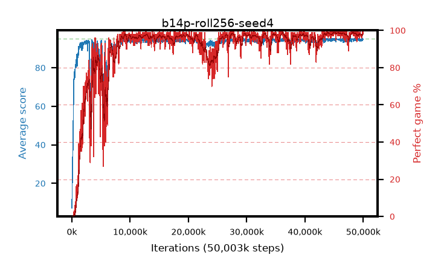

# b14p-roll256-seed4

step **50,003,968** · 1526 evals · trailing **94.56** · peak **94.73** @46,039,040 · sef **89.1** · best30 **98.7** @45,547,520

## Config

| | |
|---|---|
| algo | ppo |
| collect_envs | 128 |
| discount | 0.99 |
| eval_interval | 32768 |
| eval_queue | True |
| eval_queue_depth | 16 |
| eval_workers | 8 |
| fc_layers | (320,) |
| graph_eval_episodes | 100 |
| max_steps | 50003968 |
| min_checkpoint_score | 40.0 |
| ppo_adam_epsilon | 1e-07 |
| ppo_anneal_fraction | 1.0 |
| ppo_clip | 0.2 |
| ppo_clip_final | None |
| ppo_entropy_coef | 0.01 |
| ppo_entropy_coef_final | None |
| ppo_epochs | 4 |
| ppo_gae_lambda | 0.99 |
| ppo_gradient_clipping | 0.5 |
| ppo_horizon | 50.3 |
| ppo_learning_rate | 0.0003 |
| ppo_learning_rate_final | None |
| ppo_minibatch | 256 |
| ppo_normalize_adv | True |
| ppo_rollout | 256 |
| ppo_target_kl | 0.0 |
| ppo_transitions_per_rollout | 32768 |
| ppo_value_loss | huber |
| ppo_vf_coef | 0.5 |
| seed | 4 |
| torch_threads | 1 |

## Evals

| step | avg score | trailing avg | min score | max score | avg reward | perfect % | epsilon |
|---|---|---|---|---|---|---|---|
| 32768 | 7.2 | 7.2 | 1.0 | 18.0 | 2.56 | 0.0 |  |
| 65536 | 22.79 | 14.99 | 2.0 | 44.0 | 18.33 | 0.0 |  |
| 98304 | 26.65 | 18.88 | 2.0 | 49.0 | 21.65 | 0.0 |  |
| ... | ... | ... | ... | ... | ... | ... | ... |
| 49643520 | 94.6 | 94.55 | 67.0 | 95.0 | 190.615 | 97.0 |  |
| 49676288 | 94.81 | 94.54 | 82.0 | 95.0 | 191.82 | 98.0 |  |
| 49709056 | 93.93 | 94.52 | 24.0 | 95.0 | 188.95 | 96.0 |  |
| 49741824 | 94.51 | 94.54 | 68.0 | 95.0 | 189.53 | 96.0 |  |
| 49774592 | 94.72 | 94.53 | 76.0 | 95.0 | 190.735 | 97.0 |  |
| 49807360 | 94.14 | 94.53 | 26.0 | 95.0 | 190.155 | 97.0 |  |
| 49840128 | 94.93 | 94.55 | 88.0 | 95.0 | 192.935 | 99.0 |  |
| 49872896 | 95.0 | 94.56 | 95.0 | 95.0 | 194.0 | 100.0 |  |
| 49905664 | 94.13 | 94.51 | 8.0 | 95.0 | 192.135 | 99.0 |  |
| 49938432 | 95.0 | 94.55 | 95.0 | 95.0 | 194.0 | 100.0 |  |
| 49971200 | 94.64 | 94.55 | 69.0 | 95.0 | 191.65 | 98.0 |  |
| 50003968 | 94.71 | 94.56 | 70.0 | 95.0 | 191.72 | 98.0 |  |
