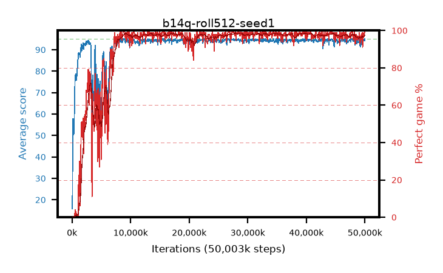

# b14q-roll512-seed1

step **50,003,968** · 763 evals · trailing **93.9** · peak **94.59** @32,243,712 · sef **87.5** · best30 **98.5** @28,508,160

## Config

| | |
|---|---|
| algo | ppo |
| collect_envs | 128 |
| discount | 0.99 |
| eval_interval | 65536 |
| eval_queue | True |
| eval_queue_depth | 16 |
| eval_workers | 8 |
| fc_layers | (320,) |
| graph_eval_episodes | 100 |
| max_steps | 50003968 |
| min_checkpoint_score | 40.0 |
| ppo_adam_epsilon | 1e-07 |
| ppo_anneal_fraction | 1.0 |
| ppo_clip | 0.2 |
| ppo_clip_final | None |
| ppo_entropy_coef | 0.01 |
| ppo_entropy_coef_final | None |
| ppo_epochs | 4 |
| ppo_gae_lambda | 0.99 |
| ppo_gradient_clipping | 0.5 |
| ppo_horizon | 50.3 |
| ppo_learning_rate | 0.0003 |
| ppo_learning_rate_final | None |
| ppo_minibatch | 256 |
| ppo_normalize_adv | True |
| ppo_rollout | 512 |
| ppo_target_kl | 0.0 |
| ppo_transitions_per_rollout | 65536 |
| ppo_value_loss | huber |
| ppo_vf_coef | 0.5 |
| seed | 1 |
| torch_threads | 1 |

## Evals

| step | avg score | trailing avg | min score | max score | avg reward | perfect % | epsilon |
|---|---|---|---|---|---|---|---|
| 65536 | 15.81 | 15.81 | 1.0 | 56.0 | 14.365 | 0.0 |  |
| 131072 | 57.75 | 45.13 | 14.0 | 83.0 | 55.0 | 0.0 |  |
| 196608 | 50.64 | 38.98 | 12.0 | 83.0 | 45.865 | 0.0 |  |
| ... | ... | ... | ... | ... | ... | ... | ... |
| 49283072 | 91.36 | 93.95 | 8.0 | 95.0 | 184.3 | 94.0 |  |
| 49348608 | 93.86 | 93.93 | 24.0 | 95.0 | 189.83 | 97.0 |  |
| 49414144 | 93.85 | 93.9 | 11.0 | 95.0 | 190.815 | 98.0 |  |
| 49479680 | 94.59 | 93.95 | 59.0 | 95.0 | 191.6 | 98.0 |  |
| 49545216 | 94.75 | 93.92 | 70.0 | 95.0 | 192.755 | 99.0 |  |
| 49610752 | 93.26 | 93.9 | 24.0 | 95.0 | 183.305 | 91.0 |  |
| 49676288 | 94.9 | 93.9 | 85.0 | 95.0 | 192.905 | 99.0 |  |
| 49741824 | 94.17 | 93.88 | 57.0 | 95.0 | 190.14 | 97.0 |  |
| 49807360 | 94.45 | 93.86 | 51.0 | 95.0 | 191.46 | 98.0 |  |
| 49872896 | 94.85 | 93.87 | 87.0 | 95.0 | 191.815 | 98.0 |  |
| 49938432 | 94.23 | 93.85 | 18.0 | 95.0 | 192.235 | 99.0 |  |
| 50003968 | 95.0 | 93.9 | 95.0 | 95.0 | 194.0 | 100.0 |  |
