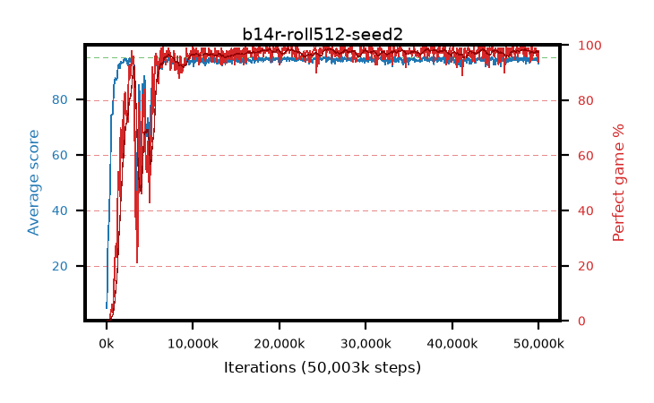

# b14r-roll512-seed2

step **50,003,968** · 763 evals · trailing **94.26** · peak **94.48** @22,216,704 · sef **91.3** · best30 **98.2** @38,535,168

## Config

| | |
|---|---|
| algo | ppo |
| collect_envs | 128 |
| discount | 0.99 |
| eval_interval | 65536 |
| eval_queue | True |
| eval_queue_depth | 16 |
| eval_workers | 8 |
| fc_layers | (320,) |
| graph_eval_episodes | 100 |
| max_steps | 50003968 |
| min_checkpoint_score | 40.0 |
| ppo_adam_epsilon | 1e-07 |
| ppo_anneal_fraction | 1.0 |
| ppo_clip | 0.2 |
| ppo_clip_final | None |
| ppo_entropy_coef | 0.01 |
| ppo_entropy_coef_final | None |
| ppo_epochs | 4 |
| ppo_gae_lambda | 0.99 |
| ppo_gradient_clipping | 0.5 |
| ppo_horizon | 50.3 |
| ppo_learning_rate | 0.0003 |
| ppo_learning_rate_final | None |
| ppo_minibatch | 256 |
| ppo_normalize_adv | True |
| ppo_rollout | 512 |
| ppo_target_kl | 0.0 |
| ppo_transitions_per_rollout | 65536 |
| ppo_value_loss | huber |
| ppo_vf_coef | 0.5 |
| seed | 2 |
| torch_threads | 1 |

## Evals

| step | avg score | trailing avg | min score | max score | avg reward | perfect % | epsilon |
|---|---|---|---|---|---|---|---|
| 65536 | 4.74 | 4.74 | 2.0 | 14.0 | -0.035 | 0.0 |  |
| 131072 | 18.43 | 11.59 | 4.0 | 43.0 | 13.655 | 0.0 |  |
| 196608 | 29.13 | 17.43 | 7.0 | 52.0 | 24.13 | 0.0 |  |
| ... | ... | ... | ... | ... | ... | ... | ... |
| 49283072 | 94.2 | 94.26 | 73.0 | 95.0 | 188.18 | 95.0 |  |
| 49348608 | 94.49 | 94.26 | 55.0 | 95.0 | 191.5 | 98.0 |  |
| 49414144 | 94.37 | 94.27 | 47.0 | 95.0 | 191.335 | 98.0 |  |
| 49479680 | 94.04 | 94.28 | 48.0 | 95.0 | 189.965 | 97.0 |  |
| 49545216 | 94.29 | 94.24 | 55.0 | 95.0 | 191.255 | 98.0 |  |
| 49610752 | 94.76 | 94.27 | 71.0 | 95.0 | 192.765 | 99.0 |  |
| 49676288 | 94.8 | 94.33 | 86.0 | 95.0 | 190.815 | 97.0 |  |
| 49741824 | 94.8 | 94.3 | 84.0 | 95.0 | 191.81 | 98.0 |  |
| 49807360 | 93.9 | 94.32 | 20.0 | 95.0 | 188.875 | 96.0 |  |
| 49872896 | 94.84 | 94.31 | 84.0 | 95.0 | 191.85 | 98.0 |  |
| 49938432 | 94.16 | 94.32 | 46.0 | 95.0 | 191.125 | 98.0 |  |
| 50003968 | 92.93 | 94.26 | 18.0 | 95.0 | 185.915 | 94.0 |  |
