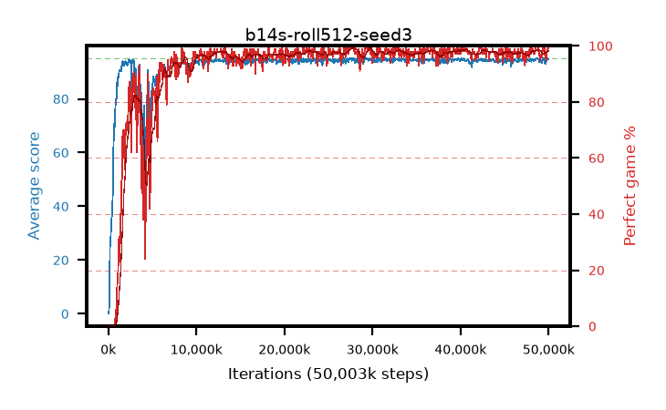

# b14s-roll512-seed3

step **50,003,968** · 763 evals · trailing **94.48** · peak **94.65** @40,501,248 · sef **91.5** · best30 **98.4** @40,501,248

## Config

| | |
|---|---|
| algo | ppo |
| collect_envs | 128 |
| discount | 0.99 |
| eval_interval | 65536 |
| eval_queue | True |
| eval_queue_depth | 16 |
| eval_workers | 8 |
| fc_layers | (320,) |
| graph_eval_episodes | 100 |
| max_steps | 50003968 |
| min_checkpoint_score | 40.0 |
| ppo_adam_epsilon | 1e-07 |
| ppo_anneal_fraction | 1.0 |
| ppo_clip | 0.2 |
| ppo_clip_final | None |
| ppo_entropy_coef | 0.01 |
| ppo_entropy_coef_final | None |
| ppo_epochs | 4 |
| ppo_gae_lambda | 0.99 |
| ppo_gradient_clipping | 0.5 |
| ppo_horizon | 50.3 |
| ppo_learning_rate | 0.0003 |
| ppo_learning_rate_final | None |
| ppo_minibatch | 256 |
| ppo_normalize_adv | True |
| ppo_rollout | 512 |
| ppo_target_kl | 0.0 |
| ppo_transitions_per_rollout | 65536 |
| ppo_value_loss | huber |
| ppo_vf_coef | 0.5 |
| seed | 3 |
| torch_threads | 1 |

## Evals

| step | avg score | trailing avg | min score | max score | avg reward | perfect % | epsilon |
|---|---|---|---|---|---|---|---|
| 65536 | 0.08 | 0.08 | 0.0 | 1.0 | -4.155 | 0.0 |  |
| 131072 | 5.21 | 2.65 | 1.0 | 13.0 | 3.0 | 0.0 |  |
| 196608 | 25.18 | 10.16 | 3.0 | 50.0 | 20.45 | 0.0 |  |
| ... | ... | ... | ... | ... | ... | ... | ... |
| 49283072 | 94.51 | 94.46 | 61.0 | 95.0 | 190.525 | 97.0 |  |
| 49348608 | 95.0 | 94.47 | 95.0 | 95.0 | 194.0 | 100.0 |  |
| 49414144 | 94.26 | 94.52 | 26.0 | 95.0 | 191.27 | 98.0 |  |
| 49479680 | 95.0 | 94.52 | 95.0 | 95.0 | 194.0 | 100.0 |  |
| 49545216 | 95.0 | 94.52 | 95.0 | 95.0 | 194.0 | 100.0 |  |
| 49610752 | 92.93 | 94.47 | 26.0 | 95.0 | 187.86 | 96.0 |  |
| 49676288 | 94.26 | 94.46 | 28.0 | 95.0 | 191.27 | 98.0 |  |
| 49741824 | 94.01 | 94.46 | 61.0 | 95.0 | 188.035 | 95.0 |  |
| 49807360 | 94.85 | 94.48 | 85.0 | 95.0 | 191.86 | 98.0 |  |
| 49872896 | 94.77 | 94.45 | 78.0 | 95.0 | 191.78 | 98.0 |  |
| 49938432 | 95.0 | 94.45 | 95.0 | 95.0 | 194.0 | 100.0 |  |
| 50003968 | 94.75 | 94.48 | 70.0 | 95.0 | 192.755 | 99.0 |  |
