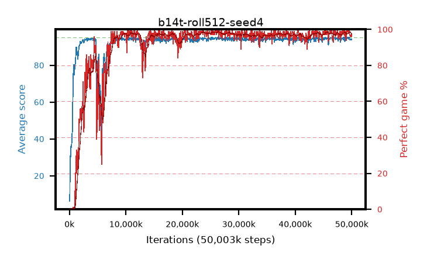

# b14t-roll512-seed4

step **50,003,968** · 763 evals · trailing **94.35** · peak **94.54** @27,000,832 · sef **88.9** · best30 **98.4** @26,607,616

## Config

| | |
|---|---|
| algo | ppo |
| collect_envs | 128 |
| discount | 0.99 |
| eval_interval | 65536 |
| eval_queue | True |
| eval_queue_depth | 16 |
| eval_workers | 8 |
| fc_layers | (320,) |
| graph_eval_episodes | 100 |
| max_steps | 50003968 |
| min_checkpoint_score | 40.0 |
| ppo_adam_epsilon | 1e-07 |
| ppo_anneal_fraction | 1.0 |
| ppo_clip | 0.2 |
| ppo_clip_final | None |
| ppo_entropy_coef | 0.01 |
| ppo_entropy_coef_final | None |
| ppo_epochs | 4 |
| ppo_gae_lambda | 0.99 |
| ppo_gradient_clipping | 0.5 |
| ppo_horizon | 50.3 |
| ppo_learning_rate | 0.0003 |
| ppo_learning_rate_final | None |
| ppo_minibatch | 256 |
| ppo_normalize_adv | True |
| ppo_rollout | 512 |
| ppo_target_kl | 0.0 |
| ppo_transitions_per_rollout | 65536 |
| ppo_value_loss | huber |
| ppo_vf_coef | 0.5 |
| seed | 4 |
| torch_threads | 1 |

## Evals

| step | avg score | trailing avg | min score | max score | avg reward | perfect % | epsilon |
|---|---|---|---|---|---|---|---|
| 65536 | 6.24 | 6.24 | 0.0 | 16.0 | 1.24 | 0.0 |  |
| 131072 | 30.75 | 22.37 | 4.0 | 55.0 | 25.84 | 0.0 |  |
| 196608 | 30.12 | 18.18 | 12.0 | 59.0 | 25.12 | 0.0 |  |
| ... | ... | ... | ... | ... | ... | ... | ... |
| 49283072 | 94.74 | 94.29 | 69.0 | 95.0 | 192.745 | 99.0 |  |
| 49348608 | 95.0 | 94.31 | 95.0 | 95.0 | 194.0 | 100.0 |  |
| 49414144 | 94.22 | 94.31 | 22.0 | 95.0 | 191.23 | 98.0 |  |
| 49479680 | 94.89 | 94.31 | 84.0 | 95.0 | 192.895 | 99.0 |  |
| 49545216 | 95.0 | 94.38 | 95.0 | 95.0 | 194.0 | 100.0 |  |
| 49610752 | 94.35 | 94.37 | 62.0 | 95.0 | 190.275 | 97.0 |  |
| 49676288 | 93.83 | 94.37 | 14.0 | 95.0 | 189.845 | 97.0 |  |
| 49741824 | 94.31 | 94.37 | 67.0 | 95.0 | 189.33 | 96.0 |  |
| 49807360 | 94.18 | 94.35 | 58.0 | 95.0 | 190.195 | 97.0 |  |
| 49872896 | 93.84 | 94.32 | 56.0 | 95.0 | 188.86 | 96.0 |  |
| 49938432 | 94.27 | 94.31 | 57.0 | 95.0 | 189.245 | 96.0 |  |
| 50003968 | 93.98 | 94.35 | 8.0 | 95.0 | 189.995 | 97.0 |  |
