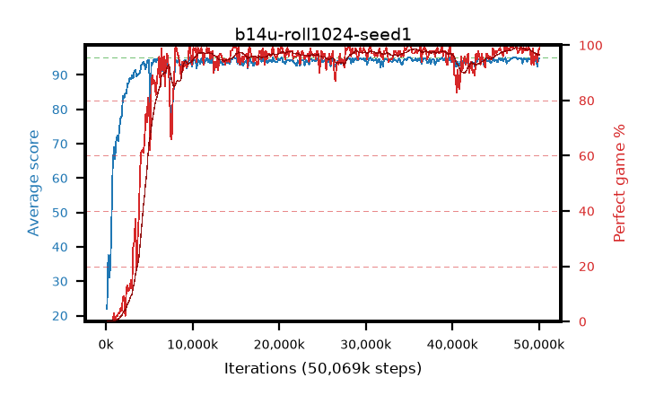

# b14u-roll1024-seed1

step **50,069,504** · 382 evals · trailing **94.44** · peak **94.55** @49,020,928 · sef **89.5** · best30 **98.5** @48,889,856

## Config

| | |
|---|---|
| algo | ppo |
| collect_envs | 128 |
| discount | 0.99 |
| eval_interval | 131072 |
| eval_queue | True |
| eval_queue_depth | 16 |
| eval_workers | 8 |
| fc_layers | (320,) |
| graph_eval_episodes | 100 |
| max_steps | 50003968 |
| min_checkpoint_score | 40.0 |
| ppo_adam_epsilon | 1e-07 |
| ppo_anneal_fraction | 1.0 |
| ppo_clip | 0.2 |
| ppo_clip_final | None |
| ppo_entropy_coef | 0.01 |
| ppo_entropy_coef_final | None |
| ppo_epochs | 4 |
| ppo_gae_lambda | 0.99 |
| ppo_gradient_clipping | 0.5 |
| ppo_horizon | 50.3 |
| ppo_learning_rate | 0.0003 |
| ppo_learning_rate_final | None |
| ppo_minibatch | 256 |
| ppo_normalize_adv | True |
| ppo_rollout | 1024 |
| ppo_target_kl | 0.0 |
| ppo_transitions_per_rollout | 131072 |
| ppo_value_loss | huber |
| ppo_vf_coef | 0.5 |
| seed | 1 |
| torch_threads | 1 |

## Evals

| step | avg score | trailing avg | min score | max score | avg reward | perfect % | epsilon |
|---|---|---|---|---|---|---|---|
| 131072 | 21.93 | 21.93 | 6.0 | 45.0 | 18.91 | 0.0 |  |
| 262144 | 37.61 | 29.77 | 10.0 | 78.0 | 32.655 | 0.0 |  |
| 393216 | 31.03 | 30.19 | 6.0 | 46.0 | 26.075 | 0.0 |  |
| ... | ... | ... | ... | ... | ... | ... | ... |
| 48627712 | 93.87 | 94.49 | 14.0 | 95.0 | 190.88 | 98.0 |  |
| 48758784 | 94.9 | 94.53 | 85.0 | 95.0 | 192.905 | 99.0 |  |
| 48889856 | 94.66 | 94.51 | 61.0 | 95.0 | 192.665 | 99.0 |  |
| 49020928 | 94.67 | 94.55 | 80.0 | 95.0 | 190.685 | 97.0 |  |
| 49152000 | 93.58 | 94.54 | 1.0 | 95.0 | 185.57 | 93.0 |  |
| 49283072 | 94.93 | 94.55 | 88.0 | 95.0 | 192.935 | 99.0 |  |
| 49414144 | 93.51 | 94.5 | 54.0 | 95.0 | 185.545 | 93.0 |  |
| 49545216 | 94.36 | 94.51 | 55.0 | 95.0 | 189.335 | 96.0 |  |
| 49676288 | 94.41 | 94.49 | 63.0 | 95.0 | 190.425 | 97.0 |  |
| 49807360 | 92.55 | 94.44 | 24.0 | 95.0 | 185.58 | 94.0 |  |
| 49938432 | 94.77 | 94.45 | 83.0 | 95.0 | 191.78 | 98.0 |  |
| 50069504 | 94.9 | 94.44 | 85.0 | 95.0 | 192.905 | 99.0 |  |
