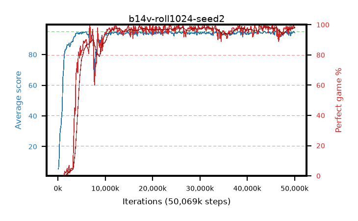

# b14v-roll1024-seed2

step **50,069,504** · 382 evals · trailing **93.7** · peak **94.39** @46,137,344 · sef **90.1** · best30 **98.1** @46,137,344

## Config

| | |
|---|---|
| algo | ppo |
| collect_envs | 128 |
| discount | 0.99 |
| eval_interval | 131072 |
| eval_queue | True |
| eval_queue_depth | 16 |
| eval_workers | 8 |
| fc_layers | (320,) |
| graph_eval_episodes | 100 |
| max_steps | 50003968 |
| min_checkpoint_score | 40.0 |
| ppo_adam_epsilon | 1e-07 |
| ppo_anneal_fraction | 1.0 |
| ppo_clip | 0.2 |
| ppo_clip_final | None |
| ppo_entropy_coef | 0.01 |
| ppo_entropy_coef_final | None |
| ppo_epochs | 4 |
| ppo_gae_lambda | 0.99 |
| ppo_gradient_clipping | 0.5 |
| ppo_horizon | 50.3 |
| ppo_learning_rate | 0.0003 |
| ppo_learning_rate_final | None |
| ppo_minibatch | 256 |
| ppo_normalize_adv | True |
| ppo_rollout | 1024 |
| ppo_target_kl | 0.0 |
| ppo_transitions_per_rollout | 131072 |
| ppo_value_loss | huber |
| ppo_vf_coef | 0.5 |
| seed | 2 |
| torch_threads | 1 |

## Evals

| step | avg score | trailing avg | min score | max score | avg reward | perfect % | epsilon |
|---|---|---|---|---|---|---|---|
| 131072 | 5.37 | 5.37 | 2.0 | 11.0 | 0.415 | 0.0 |  |
| 262144 | 12.3 | 8.84 | 2.0 | 28.0 | 7.705 | 0.0 |  |
| 393216 | 26.63 | 14.77 | 4.0 | 48.0 | 21.63 | 0.0 |  |
| ... | ... | ... | ... | ... | ... | ... | ... |
| 48627712 | 94.9 | 93.8 | 85.0 | 95.0 | 192.86 | 99.0 |  |
| 48758784 | 92.66 | 93.73 | 1.0 | 95.0 | 185.69 | 94.0 |  |
| 48889856 | 93.89 | 93.74 | 39.0 | 95.0 | 190.81 | 98.0 |  |
| 49020928 | 94.61 | 93.77 | 56.0 | 95.0 | 192.615 | 99.0 |  |
| 49152000 | 92.32 | 93.7 | 1.0 | 95.0 | 187.295 | 96.0 |  |
| 49283072 | 94.92 | 93.7 | 87.0 | 95.0 | 192.925 | 99.0 |  |
| 49414144 | 93.8 | 93.69 | 12.0 | 95.0 | 190.765 | 98.0 |  |
| 49545216 | 94.25 | 93.69 | 60.0 | 95.0 | 190.265 | 97.0 |  |
| 49676288 | 94.58 | 93.74 | 53.0 | 95.0 | 192.585 | 99.0 |  |
| 49807360 | 95.0 | 93.74 | 95.0 | 95.0 | 194.0 | 100.0 |  |
| 49938432 | 94.36 | 93.72 | 59.0 | 95.0 | 191.37 | 98.0 |  |
| 50069504 | 94.28 | 93.7 | 57.0 | 95.0 | 191.29 | 98.0 |  |
