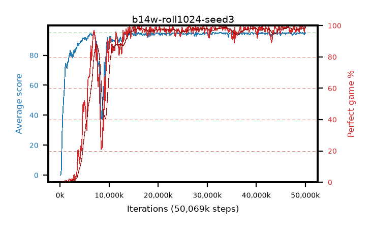

# b14w-roll1024-seed3

step **50,069,504** · 382 evals · trailing **94.57** · peak **94.6** @34,865,152 · sef **83.0** · best30 **98.3** @34,603,008

## Config

| | |
|---|---|
| algo | ppo |
| collect_envs | 128 |
| discount | 0.99 |
| eval_interval | 131072 |
| eval_queue | True |
| eval_queue_depth | 16 |
| eval_workers | 8 |
| fc_layers | (320,) |
| graph_eval_episodes | 100 |
| max_steps | 50003968 |
| min_checkpoint_score | 40.0 |
| ppo_adam_epsilon | 1e-07 |
| ppo_anneal_fraction | 1.0 |
| ppo_clip | 0.2 |
| ppo_clip_final | None |
| ppo_entropy_coef | 0.01 |
| ppo_entropy_coef_final | None |
| ppo_epochs | 4 |
| ppo_gae_lambda | 0.99 |
| ppo_gradient_clipping | 0.5 |
| ppo_horizon | 50.3 |
| ppo_learning_rate | 0.0003 |
| ppo_learning_rate_final | None |
| ppo_minibatch | 256 |
| ppo_normalize_adv | True |
| ppo_rollout | 1024 |
| ppo_target_kl | 0.0 |
| ppo_transitions_per_rollout | 131072 |
| ppo_value_loss | huber |
| ppo_vf_coef | 0.5 |
| seed | 3 |
| torch_threads | 1 |

## Evals

| step | avg score | trailing avg | min score | max score | avg reward | perfect % | epsilon |
|---|---|---|---|---|---|---|---|
| 131072 | 0.01 | 0.01 | 0.0 | 1.0 | -4.54 | 0.0 |  |
| 262144 | 3.17 | 1.59 | 0.0 | 10.0 | 2.67 | 0.0 |  |
| 393216 | 21.98 | 8.39 | 2.0 | 53.0 | 19.86 | 0.0 |  |
| ... | ... | ... | ... | ... | ... | ... | ... |
| 48627712 | 94.26 | 94.5 | 56.0 | 95.0 | 190.275 | 97.0 |  |
| 48758784 | 94.35 | 94.49 | 70.0 | 95.0 | 189.37 | 96.0 |  |
| 48889856 | 95.0 | 94.56 | 95.0 | 95.0 | 194.0 | 100.0 |  |
| 49020928 | 95.0 | 94.57 | 95.0 | 95.0 | 194.0 | 100.0 |  |
| 49152000 | 94.54 | 94.58 | 61.0 | 95.0 | 191.55 | 98.0 |  |
| 49283072 | 94.67 | 94.57 | 62.0 | 95.0 | 192.675 | 99.0 |  |
| 49414144 | 95.0 | 94.58 | 95.0 | 95.0 | 194.0 | 100.0 |  |
| 49545216 | 94.63 | 94.57 | 58.0 | 95.0 | 192.635 | 99.0 |  |
| 49676288 | 94.9 | 94.59 | 87.0 | 95.0 | 191.82 | 98.0 |  |
| 49807360 | 93.62 | 94.55 | 6.0 | 95.0 | 188.55 | 96.0 |  |
| 49938432 | 94.65 | 94.56 | 60.0 | 95.0 | 192.655 | 99.0 |  |
| 50069504 | 95.0 | 94.57 | 95.0 | 95.0 | 194.0 | 100.0 |  |
