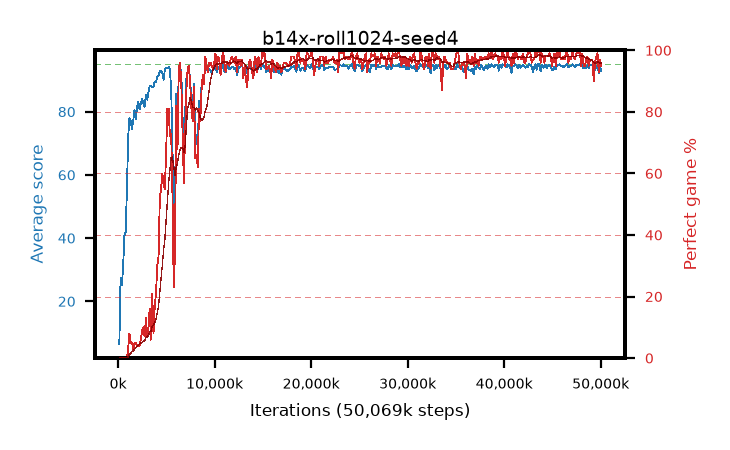

# b14x-roll1024-seed4

step **50,069,504** · 382 evals · trailing **94.28** · peak **94.51** @49,152,000 · sef **86.4** · best30 **98.0** @44,695,552

## Config

| | |
|---|---|
| algo | ppo |
| collect_envs | 128 |
| discount | 0.99 |
| eval_interval | 131072 |
| eval_queue | True |
| eval_queue_depth | 16 |
| eval_workers | 8 |
| fc_layers | (320,) |
| graph_eval_episodes | 100 |
| max_steps | 50003968 |
| min_checkpoint_score | 40.0 |
| ppo_adam_epsilon | 1e-07 |
| ppo_anneal_fraction | 1.0 |
| ppo_clip | 0.2 |
| ppo_clip_final | None |
| ppo_entropy_coef | 0.01 |
| ppo_entropy_coef_final | None |
| ppo_epochs | 4 |
| ppo_gae_lambda | 0.99 |
| ppo_gradient_clipping | 0.5 |
| ppo_horizon | 50.3 |
| ppo_learning_rate | 0.0003 |
| ppo_learning_rate_final | None |
| ppo_minibatch | 256 |
| ppo_normalize_adv | True |
| ppo_rollout | 1024 |
| ppo_target_kl | 0.0 |
| ppo_transitions_per_rollout | 131072 |
| ppo_value_loss | huber |
| ppo_vf_coef | 0.5 |
| seed | 4 |
| torch_threads | 1 |

## Evals

| step | avg score | trailing avg | min score | max score | avg reward | perfect % | epsilon |
|---|---|---|---|---|---|---|---|
| 131072 | 6.46 | 6.46 | 0.0 | 15.0 | 2.405 | 0.0 |  |
| 262144 | 27.51 | 16.98 | 10.0 | 49.0 | 22.645 | 0.0 |  |
| 393216 | 25.05 | 19.67 | 2.0 | 51.0 | 20.14 | 0.0 |  |
| ... | ... | ... | ... | ... | ... | ... | ... |
| 48627712 | 94.7 | 94.39 | 70.0 | 95.0 | 191.71 | 98.0 |  |
| 48758784 | 93.79 | 94.38 | 12.0 | 95.0 | 187.815 | 95.0 |  |
| 48889856 | 94.86 | 94.43 | 90.0 | 95.0 | 190.875 | 97.0 |  |
| 49020928 | 94.84 | 94.49 | 89.0 | 95.0 | 190.855 | 97.0 |  |
| 49152000 | 94.77 | 94.51 | 83.0 | 95.0 | 190.785 | 97.0 |  |
| 49283072 | 93.41 | 94.5 | 7.0 | 95.0 | 182.46 | 90.0 |  |
| 49414144 | 93.27 | 94.45 | 9.0 | 95.0 | 188.29 | 96.0 |  |
| 49545216 | 94.06 | 94.42 | 18.0 | 95.0 | 191.07 | 98.0 |  |
| 49676288 | 94.74 | 94.42 | 69.0 | 95.0 | 192.745 | 99.0 |  |
| 49807360 | 92.17 | 94.34 | 7.0 | 95.0 | 184.205 | 93.0 |  |
| 49938432 | 93.94 | 94.32 | 23.0 | 95.0 | 189.91 | 97.0 |  |
| 50069504 | 92.94 | 94.28 | 18.0 | 95.0 | 186.965 | 95.0 |  |
