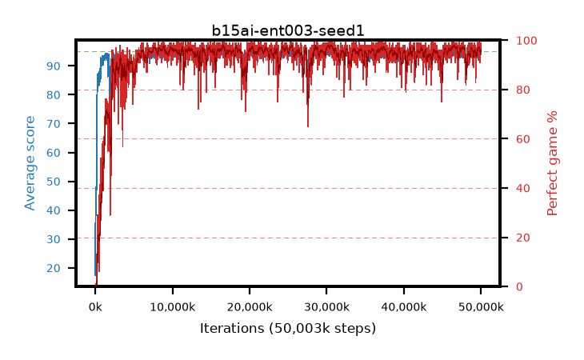

# b15ai-ent003-seed1

step **50,003,968** · 3052 evals · trailing **94.35** · peak **94.54** @30,818,304 · sef **94.6** · best30 **97.5** @30,474,240

## Config

| | |
|---|---|
| algo | ppo |
| collect_envs | 128 |
| discount | 0.99 |
| eval_interval | 16384 |
| eval_queue | True |
| eval_queue_depth | 16 |
| eval_workers | 8 |
| fc_layers | (320,) |
| graph_eval_episodes | 100 |
| max_steps | 50003968 |
| min_checkpoint_score | 40.0 |
| ppo_adam_epsilon | 1e-07 |
| ppo_anneal_fraction | 1.0 |
| ppo_clip | 0.2 |
| ppo_clip_final | None |
| ppo_entropy_coef | 0.003 |
| ppo_entropy_coef_final | None |
| ppo_epochs | 4 |
| ppo_gae_lambda | 0.98 |
| ppo_gradient_clipping | 0.5 |
| ppo_horizon | 33.6 |
| ppo_learning_rate | 0.0003 |
| ppo_learning_rate_final | None |
| ppo_minibatch | 256 |
| ppo_normalize_adv | True |
| ppo_rollout | 128 |
| ppo_target_kl | 0.0 |
| ppo_transitions_per_rollout | 16384 |
| ppo_value_loss | huber |
| ppo_vf_coef | 0.5 |
| seed | 1 |
| torch_threads | 1 |

## Evals

| step | avg score | trailing avg | min score | max score | avg reward | perfect % | epsilon |
|---|---|---|---|---|---|---|---|
| 16384 | 17.43 | 17.43 | 1.0 | 35.0 | 15.175 | 0.0 |  |
| 32768 | 47.96 | 39.66 | 17.0 | 95.0 | 44.135 | 1.0 |  |
| 49152 | 38.2 | 32.15 | 8.0 | 76.0 | 33.245 | 0.0 |  |
| ... | ... | ... | ... | ... | ... | ... | ... |
| 49823744 | 94.91 | 94.32 | 86.0 | 95.0 | 192.915 | 99.0 |  |
| 49840128 | 93.3 | 94.3 | 26.0 | 95.0 | 185.29 | 93.0 |  |
| 49856512 | 94.19 | 94.33 | 61.0 | 95.0 | 188.215 | 95.0 |  |
| 49872896 | 94.58 | 94.33 | 81.0 | 95.0 | 188.605 | 95.0 |  |
| 49889280 | 94.1 | 94.31 | 58.0 | 95.0 | 188.125 | 95.0 |  |
| 49905664 | 94.09 | 94.35 | 76.0 | 95.0 | 184.135 | 91.0 |  |
| 49922048 | 94.37 | 94.37 | 68.0 | 95.0 | 189.345 | 96.0 |  |
| 49938432 | 93.77 | 94.32 | 6.0 | 95.0 | 190.78 | 98.0 |  |
| 49954816 | 94.51 | 94.34 | 58.0 | 95.0 | 191.52 | 98.0 |  |
| 49971200 | 94.57 | 94.33 | 52.0 | 95.0 | 192.575 | 99.0 |  |
| 49987584 | 94.54 | 94.32 | 64.0 | 95.0 | 191.55 | 98.0 |  |
| 50003968 | 94.88 | 94.35 | 88.0 | 95.0 | 191.89 | 98.0 |  |
