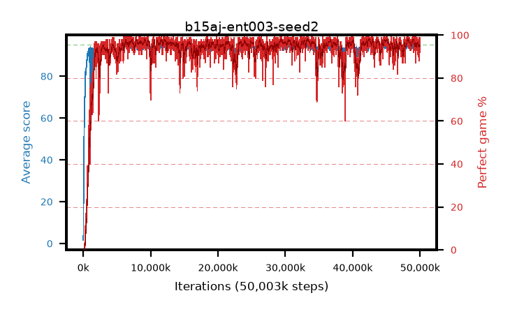

# b15aj-ent003-seed2

step **50,003,968** · 3052 evals · trailing **94.02** · peak **94.6** @33,554,432 · sef **95.8** · best30 **97.6** @33,587,200

## Config

| | |
|---|---|
| algo | ppo |
| collect_envs | 128 |
| discount | 0.99 |
| eval_interval | 16384 |
| eval_queue | True |
| eval_queue_depth | 16 |
| eval_workers | 8 |
| fc_layers | (320,) |
| graph_eval_episodes | 100 |
| max_steps | 50003968 |
| min_checkpoint_score | 40.0 |
| ppo_adam_epsilon | 1e-07 |
| ppo_anneal_fraction | 1.0 |
| ppo_clip | 0.2 |
| ppo_clip_final | None |
| ppo_entropy_coef | 0.003 |
| ppo_entropy_coef_final | None |
| ppo_epochs | 4 |
| ppo_gae_lambda | 0.98 |
| ppo_gradient_clipping | 0.5 |
| ppo_horizon | 33.6 |
| ppo_learning_rate | 0.0003 |
| ppo_learning_rate_final | None |
| ppo_minibatch | 256 |
| ppo_normalize_adv | True |
| ppo_rollout | 128 |
| ppo_target_kl | 0.0 |
| ppo_transitions_per_rollout | 16384 |
| ppo_value_loss | huber |
| ppo_vf_coef | 0.5 |
| seed | 2 |
| torch_threads | 1 |

## Evals

| step | avg score | trailing avg | min score | max score | avg reward | perfect % | epsilon |
|---|---|---|---|---|---|---|---|
| 16384 | 1.61 | 1.61 | 0.0 | 5.0 | -1.095 | 0.0 |  |
| 32768 | 5.37 | 3.49 | 0.0 | 25.0 | 3.52 | 0.0 |  |
| 49152 | 25.91 | 15.61 | 2.0 | 47.0 | 21.045 | 0.0 |  |
| ... | ... | ... | ... | ... | ... | ... | ... |
| 49823744 | 94.78 | 94.02 | 73.0 | 95.0 | 192.785 | 99.0 |  |
| 49840128 | 94.67 | 94.02 | 76.0 | 95.0 | 190.685 | 97.0 |  |
| 49856512 | 92.87 | 94.02 | 31.0 | 95.0 | 179.84 | 88.0 |  |
| 49872896 | 93.59 | 94.04 | 24.0 | 95.0 | 186.575 | 94.0 |  |
| 49889280 | 94.07 | 94.07 | 36.0 | 95.0 | 189.09 | 96.0 |  |
| 49905664 | 94.9 | 94.06 | 85.0 | 95.0 | 192.905 | 99.0 |  |
| 49922048 | 94.46 | 94.07 | 61.0 | 95.0 | 190.475 | 97.0 |  |
| 49938432 | 93.49 | 94.05 | 46.0 | 95.0 | 184.485 | 92.0 |  |
| 49954816 | 93.55 | 94.02 | 26.0 | 95.0 | 184.545 | 92.0 |  |
| 49971200 | 94.76 | 94.07 | 83.0 | 95.0 | 190.73 | 97.0 |  |
| 49987584 | 94.42 | 94.02 | 37.0 | 95.0 | 192.38 | 99.0 |  |
| 50003968 | 92.79 | 94.02 | 6.0 | 95.0 | 184.735 | 93.0 |  |
