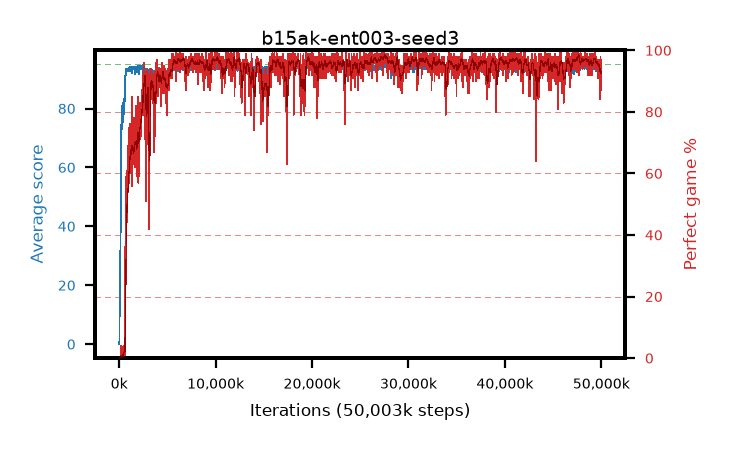

# b15ak-ent003-seed3

step **50,003,968** · 3052 evals · trailing **93.93** · peak **94.55** @27,656,192 · sef **94.4** · best30 **97.9** @27,525,120

## Config

| | |
|---|---|
| algo | ppo |
| collect_envs | 128 |
| discount | 0.99 |
| eval_interval | 16384 |
| eval_queue | True |
| eval_queue_depth | 16 |
| eval_workers | 8 |
| fc_layers | (320,) |
| graph_eval_episodes | 100 |
| max_steps | 50003968 |
| min_checkpoint_score | 40.0 |
| ppo_adam_epsilon | 1e-07 |
| ppo_anneal_fraction | 1.0 |
| ppo_clip | 0.2 |
| ppo_clip_final | None |
| ppo_entropy_coef | 0.003 |
| ppo_entropy_coef_final | None |
| ppo_epochs | 4 |
| ppo_gae_lambda | 0.98 |
| ppo_gradient_clipping | 0.5 |
| ppo_horizon | 33.6 |
| ppo_learning_rate | 0.0003 |
| ppo_learning_rate_final | None |
| ppo_minibatch | 256 |
| ppo_normalize_adv | True |
| ppo_rollout | 128 |
| ppo_target_kl | 0.0 |
| ppo_transitions_per_rollout | 16384 |
| ppo_value_loss | huber |
| ppo_vf_coef | 0.5 |
| seed | 3 |
| torch_threads | 1 |

## Evals

| step | avg score | trailing avg | min score | max score | avg reward | perfect % | epsilon |
|---|---|---|---|---|---|---|---|
| 16384 | 0.01 | 0.01 | 0.0 | 1.0 | -3.73 | 0.0 |  |
| 32768 | 1.42 | 0.71 | 0.0 | 3.0 | 0.92 | 0.0 |  |
| 49152 | 17.81 | 11.03 | 0.0 | 35.0 | 13.485 | 0.0 |  |
| ... | ... | ... | ... | ... | ... | ... | ... |
| 49823744 | 93.87 | 94.03 | 26.0 | 95.0 | 186.9 | 94.0 |  |
| 49840128 | 92.74 | 94.05 | 46.0 | 95.0 | 175.82 | 84.0 |  |
| 49856512 | 92.69 | 93.88 | 20.0 | 95.0 | 181.695 | 90.0 |  |
| 49872896 | 92.43 | 93.87 | 26.0 | 95.0 | 180.44 | 89.0 |  |
| 49889280 | 94.12 | 93.86 | 20.0 | 95.0 | 190.135 | 97.0 |  |
| 49905664 | 93.72 | 93.85 | 33.0 | 95.0 | 185.665 | 93.0 |  |
| 49922048 | 94.85 | 93.87 | 83.0 | 95.0 | 191.86 | 98.0 |  |
| 49938432 | 93.14 | 94.09 | 64.0 | 95.0 | 179.205 | 87.0 |  |
| 49954816 | 94.43 | 94.09 | 62.0 | 95.0 | 190.445 | 97.0 |  |
| 49971200 | 94.22 | 94.04 | 57.0 | 95.0 | 188.2 | 95.0 |  |
| 49987584 | 94.28 | 94.02 | 62.0 | 95.0 | 189.3 | 96.0 |  |
| 50003968 | 91.97 | 93.93 | 4.0 | 95.0 | 180.025 | 89.0 |  |
