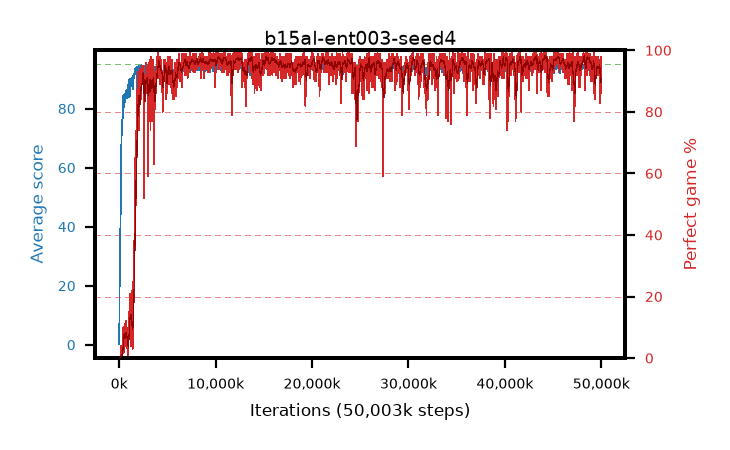

# b15al-ent003-seed4

step **50,003,968** · 3052 evals · trailing **93.77** · peak **94.45** @15,269,888 · sef **95.1** · best30 **97.6** @44,302,336

## Config

| | |
|---|---|
| algo | ppo |
| collect_envs | 128 |
| discount | 0.99 |
| eval_interval | 16384 |
| eval_queue | True |
| eval_queue_depth | 16 |
| eval_workers | 8 |
| fc_layers | (320,) |
| graph_eval_episodes | 100 |
| max_steps | 50003968 |
| min_checkpoint_score | 40.0 |
| ppo_adam_epsilon | 1e-07 |
| ppo_anneal_fraction | 1.0 |
| ppo_clip | 0.2 |
| ppo_clip_final | None |
| ppo_entropy_coef | 0.003 |
| ppo_entropy_coef_final | None |
| ppo_epochs | 4 |
| ppo_gae_lambda | 0.98 |
| ppo_gradient_clipping | 0.5 |
| ppo_horizon | 33.6 |
| ppo_learning_rate | 0.0003 |
| ppo_learning_rate_final | None |
| ppo_minibatch | 256 |
| ppo_normalize_adv | True |
| ppo_rollout | 128 |
| ppo_target_kl | 0.0 |
| ppo_transitions_per_rollout | 16384 |
| ppo_value_loss | huber |
| ppo_vf_coef | 0.5 |
| seed | 4 |
| torch_threads | 1 |

## Evals

| step | avg score | trailing avg | min score | max score | avg reward | perfect % | epsilon |
|---|---|---|---|---|---|---|---|
| 16384 | 0.23 | 0.23 | 0.0 | 2.0 | -0.54 | 0.0 |  |
| 32768 | 15.71 | 16.08 | 0.0 | 29.0 | 11.43 | 0.0 |  |
| 49152 | 23.57 | 11.9 | 3.0 | 45.0 | 18.57 | 0.0 |  |
| ... | ... | ... | ... | ... | ... | ... | ... |
| 49823744 | 93.12 | 93.77 | 18.0 | 95.0 | 185.065 | 93.0 |  |
| 49840128 | 93.63 | 93.71 | 65.0 | 95.0 | 183.675 | 91.0 |  |
| 49856512 | 91.72 | 93.86 | 20.0 | 95.0 | 173.805 | 83.0 |  |
| 49872896 | 93.76 | 93.82 | 78.0 | 95.0 | 180.685 | 88.0 |  |
| 49889280 | 92.83 | 93.77 | 25.0 | 95.0 | 179.8 | 88.0 |  |
| 49905664 | 94.06 | 93.67 | 73.0 | 95.0 | 184.06 | 91.0 |  |
| 49922048 | 91.35 | 93.66 | 13.0 | 95.0 | 174.295 | 84.0 |  |
| 49938432 | 93.23 | 93.77 | 12.0 | 95.0 | 184.27 | 92.0 |  |
| 49954816 | 92.67 | 93.74 | 19.0 | 95.0 | 181.63 | 90.0 |  |
| 49971200 | 93.78 | 93.85 | 14.0 | 95.0 | 189.795 | 97.0 |  |
| 49987584 | 94.91 | 93.8 | 89.0 | 95.0 | 191.92 | 98.0 |  |
| 50003968 | 94.46 | 93.77 | 47.0 | 95.0 | 191.425 | 98.0 |  |
