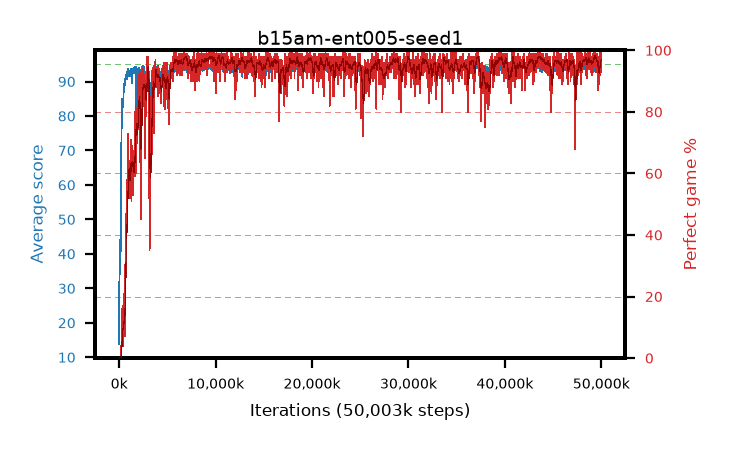

# b15am-ent005-seed1

step **50,003,968** · 3052 evals · trailing **94.22** · peak **94.55** @43,810,816 · sef **95.0** · best30 **97.7** @43,810,816

## Config

| | |
|---|---|
| algo | ppo |
| collect_envs | 128 |
| discount | 0.99 |
| eval_interval | 16384 |
| eval_queue | True |
| eval_queue_depth | 16 |
| eval_workers | 8 |
| fc_layers | (320,) |
| graph_eval_episodes | 100 |
| max_steps | 50003968 |
| min_checkpoint_score | 40.0 |
| ppo_adam_epsilon | 1e-07 |
| ppo_anneal_fraction | 1.0 |
| ppo_clip | 0.2 |
| ppo_clip_final | None |
| ppo_entropy_coef | 0.005 |
| ppo_entropy_coef_final | None |
| ppo_epochs | 4 |
| ppo_gae_lambda | 0.98 |
| ppo_gradient_clipping | 0.5 |
| ppo_horizon | 33.6 |
| ppo_learning_rate | 0.0003 |
| ppo_learning_rate_final | None |
| ppo_minibatch | 256 |
| ppo_normalize_adv | True |
| ppo_rollout | 128 |
| ppo_target_kl | 0.0 |
| ppo_transitions_per_rollout | 16384 |
| ppo_value_loss | huber |
| ppo_vf_coef | 0.5 |
| seed | 1 |
| torch_threads | 1 |

## Evals

| step | avg score | trailing avg | min score | max score | avg reward | perfect % | epsilon |
|---|---|---|---|---|---|---|---|
| 16384 | 13.82 | 13.82 | 1.0 | 35.0 | 12.285 | 0.0 |  |
| 32768 | 44.14 | 33.86 | 2.0 | 81.0 | 39.275 | 0.0 |  |
| 49152 | 34.41 | 24.11 | 6.0 | 71.0 | 29.455 | 0.0 |  |
| ... | ... | ... | ... | ... | ... | ... | ... |
| 49823744 | 95.0 | 94.28 | 95.0 | 95.0 | 194.0 | 100.0 |  |
| 49840128 | 94.68 | 94.25 | 78.0 | 95.0 | 190.695 | 97.0 |  |
| 49856512 | 94.06 | 94.25 | 27.0 | 95.0 | 189.035 | 96.0 |  |
| 49872896 | 92.97 | 94.22 | 34.0 | 95.0 | 185.955 | 94.0 |  |
| 49889280 | 94.82 | 94.26 | 77.0 | 95.0 | 192.825 | 99.0 |  |
| 49905664 | 95.0 | 94.28 | 95.0 | 95.0 | 194.0 | 100.0 |  |
| 49922048 | 93.81 | 94.22 | 63.0 | 95.0 | 184.85 | 92.0 |  |
| 49938432 | 94.45 | 94.23 | 75.0 | 95.0 | 189.47 | 96.0 |  |
| 49954816 | 94.65 | 94.28 | 60.0 | 95.0 | 192.655 | 99.0 |  |
| 49971200 | 94.33 | 94.22 | 72.0 | 95.0 | 188.355 | 95.0 |  |
| 49987584 | 94.92 | 94.23 | 87.0 | 95.0 | 192.925 | 99.0 |  |
| 50003968 | 94.97 | 94.22 | 92.0 | 95.0 | 192.975 | 99.0 |  |
