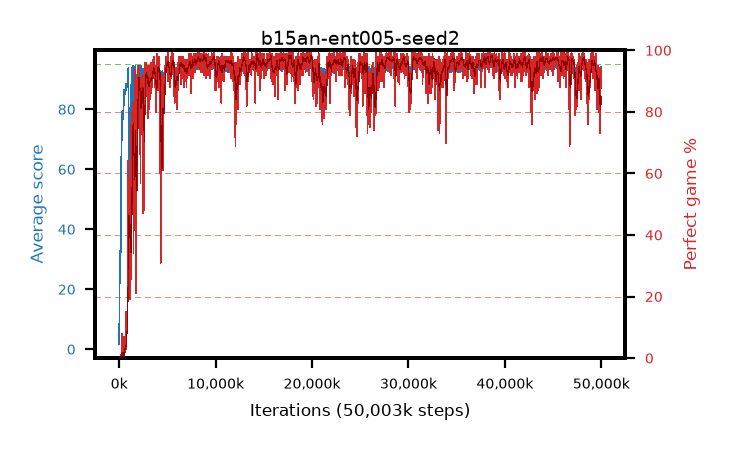

# b15an-ent005-seed2

step **50,003,968** · 3052 evals · trailing **92.41** · peak **94.59** @18,006,016 · sef **94.6** · best30 **97.4** @45,416,448

## Config

| | |
|---|---|
| algo | ppo |
| collect_envs | 128 |
| discount | 0.99 |
| eval_interval | 16384 |
| eval_queue | True |
| eval_queue_depth | 16 |
| eval_workers | 8 |
| fc_layers | (320,) |
| graph_eval_episodes | 100 |
| max_steps | 50003968 |
| min_checkpoint_score | 40.0 |
| ppo_adam_epsilon | 1e-07 |
| ppo_anneal_fraction | 1.0 |
| ppo_clip | 0.2 |
| ppo_clip_final | None |
| ppo_entropy_coef | 0.005 |
| ppo_entropy_coef_final | None |
| ppo_epochs | 4 |
| ppo_gae_lambda | 0.98 |
| ppo_gradient_clipping | 0.5 |
| ppo_horizon | 33.6 |
| ppo_learning_rate | 0.0003 |
| ppo_learning_rate_final | None |
| ppo_minibatch | 256 |
| ppo_normalize_adv | True |
| ppo_rollout | 128 |
| ppo_target_kl | 0.0 |
| ppo_transitions_per_rollout | 16384 |
| ppo_value_loss | huber |
| ppo_vf_coef | 0.5 |
| seed | 2 |
| torch_threads | 1 |

## Evals

| step | avg score | trailing avg | min score | max score | avg reward | perfect % | epsilon |
|---|---|---|---|---|---|---|---|
| 16384 | 1.72 | 1.72 | 0.0 | 5.0 | -1.165 | 0.0 |  |
| 32768 | 13.11 | 7.42 | 4.0 | 24.0 | 8.155 | 0.0 |  |
| 49152 | 25.7 | 16.4 | 3.0 | 49.0 | 20.745 | 0.0 |  |
| ... | ... | ... | ... | ... | ... | ... | ... |
| 49823744 | 93.26 | 92.95 | 66.0 | 95.0 | 179.325 | 87.0 |  |
| 49840128 | 90.8 | 92.87 | 60.0 | 95.0 | 164.88 | 75.0 |  |
| 49856512 | 90.18 | 92.76 | 66.0 | 95.0 | 162.315 | 73.0 |  |
| 49872896 | 90.72 | 92.6 | 60.0 | 95.0 | 165.795 | 76.0 |  |
| 49889280 | 91.49 | 92.66 | 67.0 | 95.0 | 167.515 | 77.0 |  |
| 49905664 | 91.58 | 92.49 | 20.0 | 95.0 | 176.605 | 86.0 |  |
| 49922048 | 92.72 | 92.44 | 10.0 | 95.0 | 178.74 | 87.0 |  |
| 49938432 | 91.65 | 92.64 | 8.0 | 95.0 | 179.66 | 89.0 |  |
| 49954816 | 93.94 | 92.46 | 73.0 | 95.0 | 184.98 | 92.0 |  |
| 49971200 | 94.04 | 92.49 | 58.0 | 95.0 | 187.025 | 94.0 |  |
| 49987584 | 92.58 | 92.47 | 63.0 | 95.0 | 179.64 | 88.0 |  |
| 50003968 | 92.69 | 92.41 | 53.0 | 95.0 | 180.7 | 89.0 |  |
