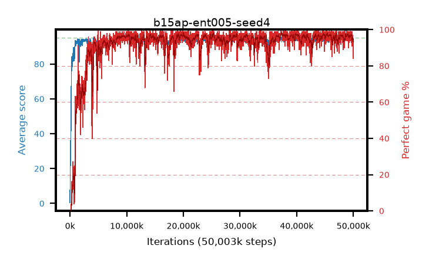

# b15ap-ent005-seed4

step **50,003,968** · 3052 evals · trailing **94.22** · peak **94.62** @48,971,776 · sef **93.0** · best30 **97.4** @37,666,816

## Config

| | |
|---|---|
| algo | ppo |
| collect_envs | 128 |
| discount | 0.99 |
| eval_interval | 16384 |
| eval_queue | True |
| eval_queue_depth | 16 |
| eval_workers | 8 |
| fc_layers | (320,) |
| graph_eval_episodes | 100 |
| max_steps | 50003968 |
| min_checkpoint_score | 40.0 |
| ppo_adam_epsilon | 1e-07 |
| ppo_anneal_fraction | 1.0 |
| ppo_clip | 0.2 |
| ppo_clip_final | None |
| ppo_entropy_coef | 0.005 |
| ppo_entropy_coef_final | None |
| ppo_epochs | 4 |
| ppo_gae_lambda | 0.98 |
| ppo_gradient_clipping | 0.5 |
| ppo_horizon | 33.6 |
| ppo_learning_rate | 0.0003 |
| ppo_learning_rate_final | None |
| ppo_minibatch | 256 |
| ppo_normalize_adv | True |
| ppo_rollout | 128 |
| ppo_target_kl | 0.0 |
| ppo_transitions_per_rollout | 16384 |
| ppo_value_loss | huber |
| ppo_vf_coef | 0.5 |
| seed | 4 |
| torch_threads | 1 |

## Evals

| step | avg score | trailing avg | min score | max score | avg reward | perfect % | epsilon |
|---|---|---|---|---|---|---|---|
| 16384 | 0.45 | 0.45 | 0.0 | 3.0 | -0.5 | 0.0 |  |
| 32768 | 18.23 | 20.03 | 1.0 | 32.0 | 13.77 | 0.0 |  |
| 49152 | 25.75 | 21.17 | 2.0 | 43.0 | 21.065 | 0.0 |  |
| ... | ... | ... | ... | ... | ... | ... | ... |
| 49823744 | 94.59 | 94.24 | 75.0 | 95.0 | 190.605 | 97.0 |  |
| 49840128 | 94.71 | 94.26 | 82.0 | 95.0 | 189.73 | 96.0 |  |
| 49856512 | 94.07 | 94.26 | 28.0 | 95.0 | 190.085 | 97.0 |  |
| 49872896 | 94.47 | 94.28 | 77.0 | 95.0 | 188.495 | 95.0 |  |
| 49889280 | 94.16 | 94.28 | 22.0 | 95.0 | 190.175 | 97.0 |  |
| 49905664 | 93.82 | 94.26 | 43.0 | 95.0 | 186.76 | 94.0 |  |
| 49922048 | 94.28 | 94.28 | 76.0 | 95.0 | 187.31 | 94.0 |  |
| 49938432 | 94.33 | 94.26 | 72.0 | 95.0 | 186.365 | 93.0 |  |
| 49954816 | 94.55 | 94.26 | 87.0 | 95.0 | 186.585 | 93.0 |  |
| 49971200 | 93.75 | 94.21 | 80.0 | 95.0 | 176.785 | 84.0 |  |
| 49987584 | 93.73 | 94.26 | 64.0 | 95.0 | 182.735 | 90.0 |  |
| 50003968 | 93.91 | 94.22 | 30.0 | 95.0 | 187.89 | 95.0 |  |
