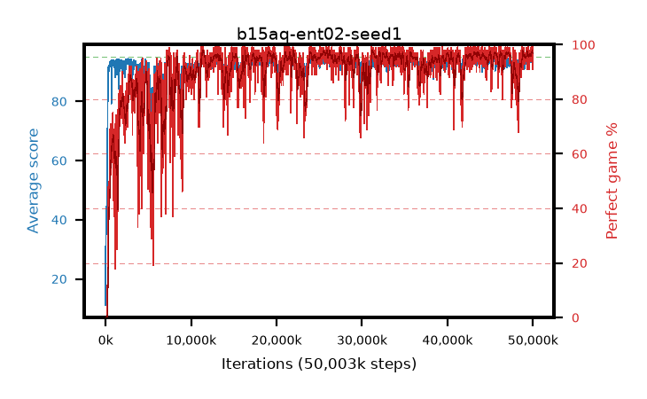

# b15aq-ent02-seed1

step **50,003,968** · 3052 evals · trailing **94.22** · peak **94.27** @49,905,664 · sef **87.3** · best30 **97.3** @25,870,336

## Config

| | |
|---|---|
| algo | ppo |
| collect_envs | 128 |
| discount | 0.99 |
| eval_interval | 16384 |
| eval_queue | True |
| eval_queue_depth | 16 |
| eval_workers | 8 |
| fc_layers | (320,) |
| graph_eval_episodes | 100 |
| max_steps | 50003968 |
| min_checkpoint_score | 40.0 |
| ppo_adam_epsilon | 1e-07 |
| ppo_anneal_fraction | 1.0 |
| ppo_clip | 0.2 |
| ppo_clip_final | None |
| ppo_entropy_coef | 0.02 |
| ppo_entropy_coef_final | None |
| ppo_epochs | 4 |
| ppo_gae_lambda | 0.98 |
| ppo_gradient_clipping | 0.5 |
| ppo_horizon | 33.6 |
| ppo_learning_rate | 0.0003 |
| ppo_learning_rate_final | None |
| ppo_minibatch | 256 |
| ppo_normalize_adv | True |
| ppo_rollout | 128 |
| ppo_target_kl | 0.0 |
| ppo_transitions_per_rollout | 16384 |
| ppo_value_loss | huber |
| ppo_vf_coef | 0.5 |
| seed | 1 |
| torch_threads | 1 |

## Evals

| step | avg score | trailing avg | min score | max score | avg reward | perfect % | epsilon |
|---|---|---|---|---|---|---|---|
| 16384 | 11.13 | 11.13 | 1.0 | 35.0 | 9.937 | 0.0 |  |
| 32768 | 44.43 | 33.05 | 10.0 | 76.0 | 39.271 | 0.0 |  |
| 49152 | 37.56 | 24.35 | 5.0 | 64.0 | 32.513 | 0.0 |  |
| ... | ... | ... | ... | ... | ... | ... | ... |
| 49823744 | 94.19 | 94.08 | 46.0 | 95.0 | 188.851 | 96.0 |  |
| 49840128 | 95.0 | 94.13 | 95.0 | 95.0 | 193.704 | 100.0 |  |
| 49856512 | 94.01 | 94.11 | 32.0 | 95.0 | 188.72 | 96.0 |  |
| 49872896 | 94.83 | 94.14 | 78.0 | 95.0 | 192.536 | 99.0 |  |
| 49889280 | 93.95 | 94.11 | 54.0 | 95.0 | 189.667 | 97.0 |  |
| 49905664 | 94.86 | 94.27 | 87.0 | 95.0 | 191.583 | 98.0 |  |
| 49922048 | 94.38 | 94.22 | 58.0 | 95.0 | 191.08 | 98.0 |  |
| 49938432 | 95.0 | 94.16 | 95.0 | 95.0 | 193.705 | 100.0 |  |
| 49954816 | 92.47 | 94.22 | 16.0 | 95.0 | 182.181 | 91.0 |  |
| 49971200 | 94.02 | 94.24 | 63.0 | 95.0 | 187.737 | 95.0 |  |
| 49987584 | 92.83 | 94.13 | 7.0 | 95.0 | 186.534 | 95.0 |  |
| 50003968 | 94.03 | 94.22 | 58.0 | 95.0 | 189.729 | 97.0 |  |
