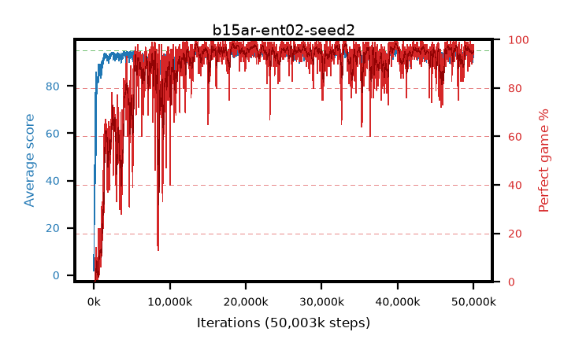

# b15ar-ent02-seed2

step **50,003,968** · 3052 evals · trailing **93.01** · peak **94.51** @40,058,880 · sef **86.0** · best30 **97.8** @39,944,192

## Config

| | |
|---|---|
| algo | ppo |
| collect_envs | 128 |
| discount | 0.99 |
| eval_interval | 16384 |
| eval_queue | True |
| eval_queue_depth | 16 |
| eval_workers | 8 |
| fc_layers | (320,) |
| graph_eval_episodes | 100 |
| max_steps | 50003968 |
| min_checkpoint_score | 40.0 |
| ppo_adam_epsilon | 1e-07 |
| ppo_anneal_fraction | 1.0 |
| ppo_clip | 0.2 |
| ppo_clip_final | None |
| ppo_entropy_coef | 0.02 |
| ppo_entropy_coef_final | None |
| ppo_epochs | 4 |
| ppo_gae_lambda | 0.98 |
| ppo_gradient_clipping | 0.5 |
| ppo_horizon | 33.6 |
| ppo_learning_rate | 0.0003 |
| ppo_learning_rate_final | None |
| ppo_minibatch | 256 |
| ppo_normalize_adv | True |
| ppo_rollout | 128 |
| ppo_target_kl | 0.0 |
| ppo_transitions_per_rollout | 16384 |
| ppo_value_loss | huber |
| ppo_vf_coef | 0.5 |
| seed | 2 |
| torch_threads | 1 |

## Evals

| step | avg score | trailing avg | min score | max score | avg reward | perfect % | epsilon |
|---|---|---|---|---|---|---|---|
| 16384 | 1.85 | 1.85 | 0.0 | 6.0 | -0.979 | 0.0 |  |
| 32768 | 17.14 | 21.85 | 5.0 | 42.0 | 12.162 | 0.0 |  |
| 49152 | 25.21 | 13.53 | 7.0 | 50.0 | 20.165 | 0.0 |  |
| ... | ... | ... | ... | ... | ... | ... | ... |
| 49823744 | 94.68 | 93.25 | 77.0 | 95.0 | 191.388 | 98.0 |  |
| 49840128 | 93.96 | 93.28 | 3.0 | 95.0 | 190.673 | 98.0 |  |
| 49856512 | 92.69 | 93.11 | 1.0 | 95.0 | 186.41 | 95.0 |  |
| 49872896 | 89.94 | 93.15 | 1.0 | 95.0 | 180.698 | 92.0 |  |
| 49889280 | 93.61 | 93.13 | 40.0 | 95.0 | 187.296 | 95.0 |  |
| 49905664 | 93.31 | 93.12 | 35.0 | 95.0 | 185.002 | 93.0 |  |
| 49922048 | 92.98 | 92.97 | 1.0 | 95.0 | 185.718 | 94.0 |  |
| 49938432 | 93.83 | 93.1 | 3.0 | 95.0 | 190.543 | 98.0 |  |
| 49954816 | 92.14 | 92.9 | 1.0 | 95.0 | 184.878 | 94.0 |  |
| 49971200 | 93.13 | 92.93 | 3.0 | 95.0 | 187.858 | 96.0 |  |
| 49987584 | 94.44 | 93.05 | 56.0 | 95.0 | 191.152 | 98.0 |  |
| 50003968 | 92.36 | 93.01 | 4.0 | 95.0 | 185.084 | 94.0 |  |
