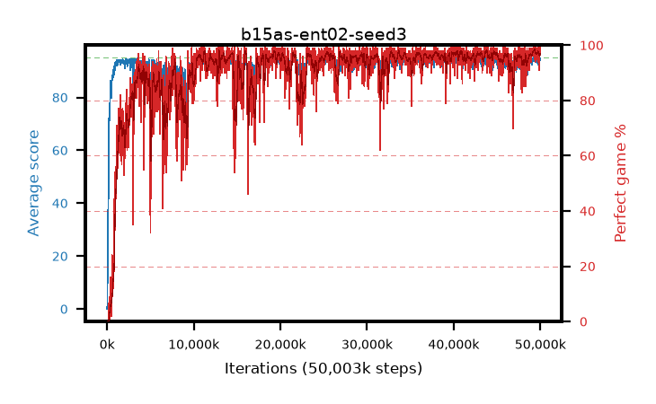

# b15as-ent02-seed3

step **50,003,968** · 3052 evals · trailing **94.21** · peak **94.53** @49,627,136 · sef **88.2** · best30 **97.8** @49,463,296

## Config

| | |
|---|---|
| algo | ppo |
| collect_envs | 128 |
| discount | 0.99 |
| eval_interval | 16384 |
| eval_queue | True |
| eval_queue_depth | 16 |
| eval_workers | 8 |
| fc_layers | (320,) |
| graph_eval_episodes | 100 |
| max_steps | 50003968 |
| min_checkpoint_score | 40.0 |
| ppo_adam_epsilon | 1e-07 |
| ppo_anneal_fraction | 1.0 |
| ppo_clip | 0.2 |
| ppo_clip_final | None |
| ppo_entropy_coef | 0.02 |
| ppo_entropy_coef_final | None |
| ppo_epochs | 4 |
| ppo_gae_lambda | 0.98 |
| ppo_gradient_clipping | 0.5 |
| ppo_horizon | 33.6 |
| ppo_learning_rate | 0.0003 |
| ppo_learning_rate_final | None |
| ppo_minibatch | 256 |
| ppo_normalize_adv | True |
| ppo_rollout | 128 |
| ppo_target_kl | 0.0 |
| ppo_transitions_per_rollout | 16384 |
| ppo_value_loss | huber |
| ppo_vf_coef | 0.5 |
| seed | 3 |
| torch_threads | 1 |

## Evals

| step | avg score | trailing avg | min score | max score | avg reward | perfect % | epsilon |
|---|---|---|---|---|---|---|---|
| 16384 | 0.01 | 0.01 | 0.0 | 1.0 | -2.944 | 0.0 |  |
| 32768 | 1.49 | 0.75 | 0.0 | 7.0 | 0.838 | 0.0 |  |
| 49152 | 19.42 | 6.97 | 0.0 | 37.0 | 14.844 | 0.0 |  |
| ... | ... | ... | ... | ... | ... | ... | ... |
| 49823744 | 94.85 | 94.27 | 84.0 | 95.0 | 191.575 | 98.0 |  |
| 49840128 | 92.97 | 94.24 | 6.0 | 95.0 | 186.709 | 95.0 |  |
| 49856512 | 93.74 | 94.21 | 26.0 | 95.0 | 187.458 | 95.0 |  |
| 49872896 | 95.0 | 94.23 | 95.0 | 95.0 | 193.696 | 100.0 |  |
| 49889280 | 93.62 | 94.2 | 64.0 | 95.0 | 183.323 | 91.0 |  |
| 49905664 | 93.38 | 94.16 | 12.0 | 95.0 | 188.083 | 96.0 |  |
| 49922048 | 94.51 | 94.26 | 57.0 | 95.0 | 190.209 | 97.0 |  |
| 49938432 | 94.93 | 94.26 | 88.0 | 95.0 | 192.64 | 99.0 |  |
| 49954816 | 94.73 | 94.23 | 68.0 | 95.0 | 192.434 | 99.0 |  |
| 49971200 | 94.68 | 94.26 | 72.0 | 95.0 | 191.382 | 98.0 |  |
| 49987584 | 93.97 | 94.28 | 22.0 | 95.0 | 189.679 | 97.0 |  |
| 50003968 | 94.94 | 94.21 | 89.0 | 95.0 | 192.662 | 99.0 |  |
