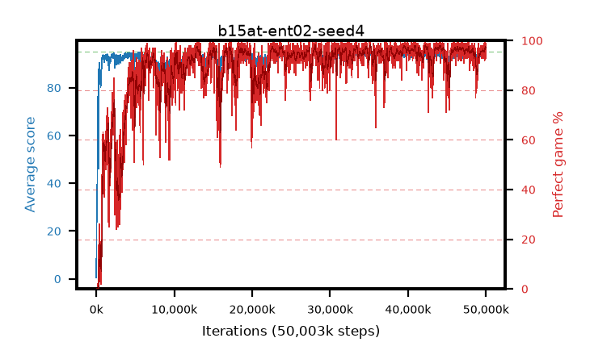

# b15at-ent02-seed4

step **50,003,968** · 3052 evals · trailing **94.35** · peak **94.35** @44,154,880 · sef **86.1** · best30 **97.4** @42,467,328

## Config

| | |
|---|---|
| algo | ppo |
| collect_envs | 128 |
| discount | 0.99 |
| eval_interval | 16384 |
| eval_queue | True |
| eval_queue_depth | 16 |
| eval_workers | 8 |
| fc_layers | (320,) |
| graph_eval_episodes | 100 |
| max_steps | 50003968 |
| min_checkpoint_score | 40.0 |
| ppo_adam_epsilon | 1e-07 |
| ppo_anneal_fraction | 1.0 |
| ppo_clip | 0.2 |
| ppo_clip_final | None |
| ppo_entropy_coef | 0.02 |
| ppo_entropy_coef_final | None |
| ppo_epochs | 4 |
| ppo_gae_lambda | 0.98 |
| ppo_gradient_clipping | 0.5 |
| ppo_horizon | 33.6 |
| ppo_learning_rate | 0.0003 |
| ppo_learning_rate_final | None |
| ppo_minibatch | 256 |
| ppo_normalize_adv | True |
| ppo_rollout | 128 |
| ppo_target_kl | 0.0 |
| ppo_transitions_per_rollout | 16384 |
| ppo_value_loss | huber |
| ppo_vf_coef | 0.5 |
| seed | 4 |
| torch_threads | 1 |

## Evals

| step | avg score | trailing avg | min score | max score | avg reward | perfect % | epsilon |
|---|---|---|---|---|---|---|---|
| 16384 | 0.52 | 0.52 | 0.0 | 4.0 | -0.483 | 0.0 |  |
| 32768 | 15.65 | 18.66 | 2.0 | 31.0 | 10.966 | 0.0 |  |
| 49152 | 28.14 | 14.33 | 13.0 | 47.0 | 23.145 | 0.0 |  |
| ... | ... | ... | ... | ... | ... | ... | ... |
| 49823744 | 94.26 | 94.29 | 80.0 | 95.0 | 184.966 | 92.0 |  |
| 49840128 | 94.74 | 94.27 | 79.0 | 95.0 | 191.444 | 98.0 |  |
| 49856512 | 94.61 | 94.31 | 57.0 | 95.0 | 191.265 | 98.0 |  |
| 49872896 | 94.29 | 94.35 | 24.0 | 95.0 | 191.989 | 99.0 |  |
| 49889280 | 95.0 | 94.35 | 95.0 | 95.0 | 193.698 | 100.0 |  |
| 49905664 | 93.35 | 94.25 | 5.0 | 95.0 | 188.063 | 96.0 |  |
| 49922048 | 94.78 | 94.29 | 73.0 | 95.0 | 192.465 | 99.0 |  |
| 49938432 | 94.45 | 94.29 | 76.0 | 95.0 | 187.158 | 94.0 |  |
| 49954816 | 94.1 | 94.33 | 16.0 | 95.0 | 189.779 | 97.0 |  |
| 49971200 | 94.92 | 94.35 | 87.0 | 95.0 | 192.621 | 99.0 |  |
| 49987584 | 94.31 | 94.34 | 77.0 | 95.0 | 186.021 | 93.0 |  |
| 50003968 | 94.28 | 94.35 | 28.0 | 95.0 | 190.99 | 98.0 |  |
