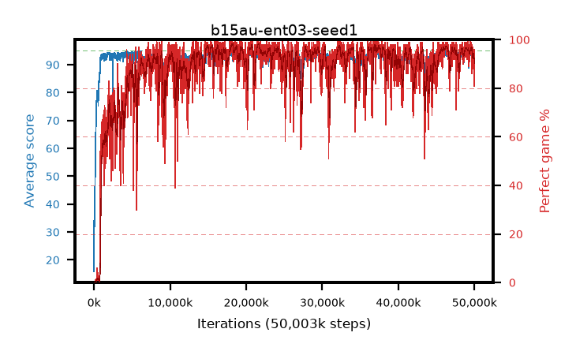

# b15au-ent03-seed1

step **50,003,968** · 3052 evals · trailing **93.13** · peak **94.32** @20,840,448 · sef **85.0** · best30 **97.3** @18,251,776

## Config

| | |
|---|---|
| algo | ppo |
| collect_envs | 128 |
| discount | 0.99 |
| eval_interval | 16384 |
| eval_queue | True |
| eval_queue_depth | 16 |
| eval_workers | 8 |
| fc_layers | (320,) |
| graph_eval_episodes | 100 |
| max_steps | 50003968 |
| min_checkpoint_score | 40.0 |
| ppo_adam_epsilon | 1e-07 |
| ppo_anneal_fraction | 1.0 |
| ppo_clip | 0.2 |
| ppo_clip_final | None |
| ppo_entropy_coef | 0.03 |
| ppo_entropy_coef_final | None |
| ppo_epochs | 4 |
| ppo_gae_lambda | 0.98 |
| ppo_gradient_clipping | 0.5 |
| ppo_horizon | 33.6 |
| ppo_learning_rate | 0.0003 |
| ppo_learning_rate_final | None |
| ppo_minibatch | 256 |
| ppo_normalize_adv | True |
| ppo_rollout | 128 |
| ppo_target_kl | 0.0 |
| ppo_transitions_per_rollout | 16384 |
| ppo_value_loss | huber |
| ppo_vf_coef | 0.5 |
| seed | 1 |
| torch_threads | 1 |

## Evals

| step | avg score | trailing avg | min score | max score | avg reward | perfect % | epsilon |
|---|---|---|---|---|---|---|---|
| 16384 | 15.86 | 29.82 | 1.0 | 37.0 | 13.745 | 0.0 |  |
| 32768 | 46.31 | 35.48 | 11.0 | 80.0 | 41.228 | 0.0 |  |
| 49152 | 34.1 | 34.1 | 13.0 | 64.0 | 29.03 | 0.0 |  |
| ... | ... | ... | ... | ... | ... | ... | ... |
| 49823744 | 91.69 | 93.53 | 3.0 | 95.0 | 184.408 | 94.0 |  |
| 49840128 | 92.12 | 93.52 | 1.0 | 95.0 | 186.836 | 96.0 |  |
| 49856512 | 93.74 | 93.6 | 5.0 | 95.0 | 186.455 | 94.0 |  |
| 49872896 | 92.79 | 93.62 | 9.0 | 95.0 | 186.506 | 95.0 |  |
| 49889280 | 93.95 | 93.49 | 60.0 | 95.0 | 187.655 | 95.0 |  |
| 49905664 | 91.71 | 93.56 | 7.0 | 95.0 | 178.462 | 88.0 |  |
| 49922048 | 91.69 | 93.43 | 9.0 | 95.0 | 178.411 | 88.0 |  |
| 49938432 | 91.35 | 93.35 | 13.0 | 95.0 | 177.09 | 87.0 |  |
| 49954816 | 93.97 | 93.25 | 58.0 | 95.0 | 188.644 | 96.0 |  |
| 49971200 | 92.45 | 93.28 | 62.0 | 95.0 | 181.167 | 90.0 |  |
| 49987584 | 92.73 | 93.24 | 58.0 | 95.0 | 181.425 | 90.0 |  |
| 50003968 | 89.69 | 93.13 | 55.0 | 95.0 | 169.407 | 81.0 |  |
