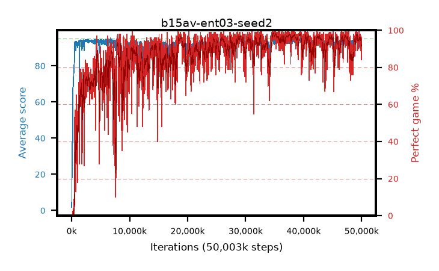

# b15av-ent03-seed2

step **50,003,968** · 3052 evals · trailing **93.18** · peak **94.19** @34,865,152 · sef **79.7** · best30 **97.9** @34,979,840

## Config

| | |
|---|---|
| algo | ppo |
| collect_envs | 128 |
| discount | 0.99 |
| eval_interval | 16384 |
| eval_queue | True |
| eval_queue_depth | 16 |
| eval_workers | 8 |
| fc_layers | (320,) |
| graph_eval_episodes | 100 |
| max_steps | 50003968 |
| min_checkpoint_score | 40.0 |
| ppo_adam_epsilon | 1e-07 |
| ppo_anneal_fraction | 1.0 |
| ppo_clip | 0.2 |
| ppo_clip_final | None |
| ppo_entropy_coef | 0.03 |
| ppo_entropy_coef_final | None |
| ppo_epochs | 4 |
| ppo_gae_lambda | 0.98 |
| ppo_gradient_clipping | 0.5 |
| ppo_horizon | 33.6 |
| ppo_learning_rate | 0.0003 |
| ppo_learning_rate_final | None |
| ppo_minibatch | 256 |
| ppo_normalize_adv | True |
| ppo_rollout | 128 |
| ppo_target_kl | 0.0 |
| ppo_transitions_per_rollout | 16384 |
| ppo_value_loss | huber |
| ppo_vf_coef | 0.5 |
| seed | 2 |
| torch_threads | 1 |

## Evals

| step | avg score | trailing avg | min score | max score | avg reward | perfect % | epsilon |
|---|---|---|---|---|---|---|---|
| 16384 | 1.79 | 1.79 | 0.0 | 6.0 | -0.904 | 0.0 |  |
| 32768 | 6.66 | 20.05 | 0.0 | 21.0 | 2.927 | 0.0 |  |
| 49152 | 23.56 | 18.67 | 5.0 | 53.0 | 18.561 | 0.0 |  |
| ... | ... | ... | ... | ... | ... | ... | ... |
| 49823744 | 94.5 | 93.16 | 66.0 | 95.0 | 190.204 | 97.0 |  |
| 49840128 | 93.57 | 93.02 | 62.0 | 95.0 | 183.269 | 91.0 |  |
| 49856512 | 93.08 | 93.12 | 57.0 | 95.0 | 181.745 | 90.0 |  |
| 49872896 | 93.48 | 93.09 | 56.0 | 95.0 | 187.198 | 95.0 |  |
| 49889280 | 92.41 | 93.14 | 1.0 | 95.0 | 183.122 | 92.0 |  |
| 49905664 | 92.34 | 93.09 | 1.0 | 95.0 | 179.997 | 89.0 |  |
| 49922048 | 94.12 | 93.16 | 68.0 | 95.0 | 185.797 | 93.0 |  |
| 49938432 | 92.38 | 93.16 | 57.0 | 95.0 | 175.081 | 84.0 |  |
| 49954816 | 94.0 | 93.18 | 57.0 | 95.0 | 188.664 | 96.0 |  |
| 49971200 | 93.66 | 93.15 | 72.0 | 95.0 | 184.356 | 92.0 |  |
| 49987584 | 93.45 | 93.16 | 58.0 | 95.0 | 184.1 | 92.0 |  |
| 50003968 | 93.44 | 93.18 | 70.0 | 95.0 | 184.152 | 92.0 |  |
