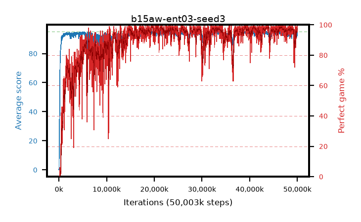

# b15aw-ent03-seed3

step **50,003,968** · 3052 evals · trailing **93.61** · peak **94.62** @39,321,600 · sef **85.1** · best30 **98.3** @46,628,864

## Config

| | |
|---|---|
| algo | ppo |
| collect_envs | 128 |
| discount | 0.99 |
| eval_interval | 16384 |
| eval_queue | True |
| eval_queue_depth | 16 |
| eval_workers | 8 |
| fc_layers | (320,) |
| graph_eval_episodes | 100 |
| max_steps | 50003968 |
| min_checkpoint_score | 40.0 |
| ppo_adam_epsilon | 1e-07 |
| ppo_anneal_fraction | 1.0 |
| ppo_clip | 0.2 |
| ppo_clip_final | None |
| ppo_entropy_coef | 0.03 |
| ppo_entropy_coef_final | None |
| ppo_epochs | 4 |
| ppo_gae_lambda | 0.98 |
| ppo_gradient_clipping | 0.5 |
| ppo_horizon | 33.6 |
| ppo_learning_rate | 0.0003 |
| ppo_learning_rate_final | None |
| ppo_minibatch | 256 |
| ppo_normalize_adv | True |
| ppo_rollout | 128 |
| ppo_target_kl | 0.0 |
| ppo_transitions_per_rollout | 16384 |
| ppo_value_loss | huber |
| ppo_vf_coef | 0.5 |
| seed | 3 |
| torch_threads | 1 |

## Evals

| step | avg score | trailing avg | min score | max score | avg reward | perfect % | epsilon |
|---|---|---|---|---|---|---|---|
| 16384 | 0.06 | 0.06 | 0.0 | 1.0 | -2.871 | 0.0 |  |
| 32768 | 1.01 | 0.54 | 0.0 | 5.0 | 0.441 | 0.0 |  |
| 49152 | 10.38 | 10.74 | 0.0 | 36.0 | 7.428 | 0.0 |  |
| ... | ... | ... | ... | ... | ... | ... | ... |
| 49823744 | 94.97 | 93.12 | 92.0 | 95.0 | 192.628 | 99.0 |  |
| 49840128 | 94.79 | 93.07 | 80.0 | 95.0 | 191.467 | 98.0 |  |
| 49856512 | 94.81 | 93.18 | 76.0 | 95.0 | 192.496 | 99.0 |  |
| 49872896 | 93.91 | 93.41 | 65.0 | 95.0 | 187.618 | 95.0 |  |
| 49889280 | 94.54 | 93.31 | 70.0 | 95.0 | 191.234 | 98.0 |  |
| 49905664 | 91.38 | 93.19 | 3.0 | 95.0 | 186.108 | 96.0 |  |
| 49922048 | 91.68 | 93.29 | 5.0 | 95.0 | 185.401 | 95.0 |  |
| 49938432 | 93.51 | 93.58 | 3.0 | 95.0 | 188.227 | 96.0 |  |
| 49954816 | 93.81 | 93.57 | 10.0 | 95.0 | 189.524 | 97.0 |  |
| 49971200 | 95.0 | 93.51 | 95.0 | 95.0 | 193.704 | 100.0 |  |
| 49987584 | 95.0 | 93.61 | 95.0 | 95.0 | 193.701 | 100.0 |  |
| 50003968 | 95.0 | 93.61 | 95.0 | 95.0 | 193.691 | 100.0 |  |
