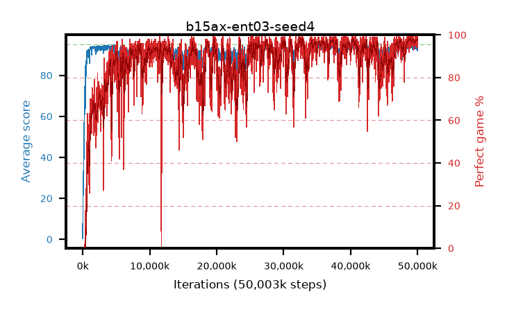

# b15ax-ent03-seed4

step **50,003,968** · 3052 evals · trailing **94.23** · peak **94.6** @49,020,928 · sef **80.0** · best30 **98.0** @48,955,392

## Config

| | |
|---|---|
| algo | ppo |
| collect_envs | 128 |
| discount | 0.99 |
| eval_interval | 16384 |
| eval_queue | True |
| eval_queue_depth | 16 |
| eval_workers | 8 |
| fc_layers | (320,) |
| graph_eval_episodes | 100 |
| max_steps | 50003968 |
| min_checkpoint_score | 40.0 |
| ppo_adam_epsilon | 1e-07 |
| ppo_anneal_fraction | 1.0 |
| ppo_clip | 0.2 |
| ppo_clip_final | None |
| ppo_entropy_coef | 0.03 |
| ppo_entropy_coef_final | None |
| ppo_epochs | 4 |
| ppo_gae_lambda | 0.98 |
| ppo_gradient_clipping | 0.5 |
| ppo_horizon | 33.6 |
| ppo_learning_rate | 0.0003 |
| ppo_learning_rate_final | None |
| ppo_minibatch | 256 |
| ppo_normalize_adv | True |
| ppo_rollout | 128 |
| ppo_target_kl | 0.0 |
| ppo_transitions_per_rollout | 16384 |
| ppo_value_loss | huber |
| ppo_vf_coef | 0.5 |
| seed | 4 |
| torch_threads | 1 |

## Evals

| step | avg score | trailing avg | min score | max score | avg reward | perfect % | epsilon |
|---|---|---|---|---|---|---|---|
| 16384 | 0.37 | 0.37 | 0.0 | 2.0 | -0.537 | 0.0 |  |
| 32768 | 18.98 | 17.96 | 1.0 | 37.0 | 14.669 | 0.0 |  |
| 49152 | 25.56 | 12.96 | 6.0 | 44.0 | 20.526 | 0.0 |  |
| ... | ... | ... | ... | ... | ... | ... | ... |
| 49823744 | 93.89 | 94.18 | 53.0 | 95.0 | 189.586 | 97.0 |  |
| 49840128 | 94.69 | 94.16 | 64.0 | 95.0 | 192.38 | 99.0 |  |
| 49856512 | 94.75 | 94.18 | 70.0 | 95.0 | 192.447 | 99.0 |  |
| 49872896 | 93.87 | 94.2 | 51.0 | 95.0 | 186.535 | 94.0 |  |
| 49889280 | 92.81 | 94.17 | 14.0 | 95.0 | 188.503 | 97.0 |  |
| 49905664 | 95.0 | 94.25 | 95.0 | 95.0 | 193.705 | 100.0 |  |
| 49922048 | 94.67 | 94.3 | 62.0 | 95.0 | 192.376 | 99.0 |  |
| 49938432 | 94.66 | 94.27 | 61.0 | 95.0 | 192.353 | 99.0 |  |
| 49954816 | 93.47 | 94.26 | 22.0 | 95.0 | 189.189 | 97.0 |  |
| 49971200 | 94.61 | 94.28 | 65.0 | 95.0 | 190.334 | 97.0 |  |
| 49987584 | 92.13 | 94.22 | 13.0 | 95.0 | 185.856 | 95.0 |  |
| 50003968 | 94.99 | 94.23 | 94.0 | 95.0 | 192.652 | 99.0 |  |
