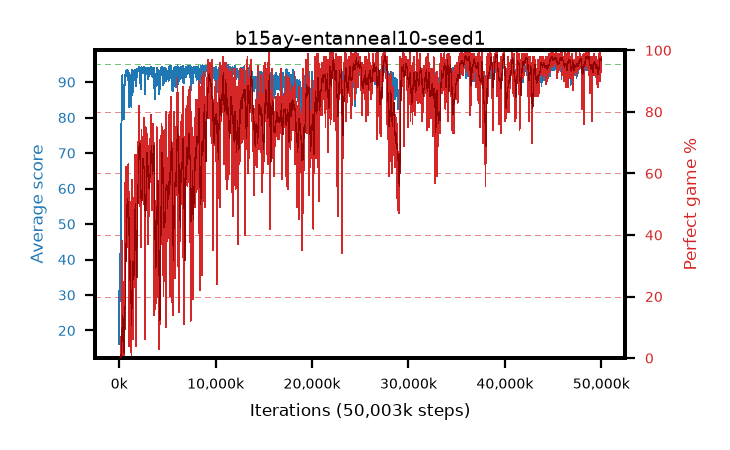

# b15ay-entanneal10-seed1

step **50,003,968** · 3052 evals · trailing **92.91** · peak **94.32** @48,676,864 · sef **66.9** · best30 **97.7** @48,693,248

## Config

| | |
|---|---|
| algo | ppo |
| collect_envs | 128 |
| discount | 0.99 |
| eval_interval | 16384 |
| eval_queue | True |
| eval_queue_depth | 16 |
| eval_workers | 8 |
| fc_layers | (320,) |
| graph_eval_episodes | 100 |
| max_steps | 50003968 |
| min_checkpoint_score | 40.0 |
| ppo_adam_epsilon | 1e-07 |
| ppo_anneal_fraction | 1.0 |
| ppo_clip | 0.2 |
| ppo_clip_final | None |
| ppo_entropy_coef | 0.1 |
| ppo_entropy_coef_final | 0.001 |
| ppo_epochs | 4 |
| ppo_gae_lambda | 0.98 |
| ppo_gradient_clipping | 0.5 |
| ppo_horizon | 33.6 |
| ppo_learning_rate | 0.0003 |
| ppo_learning_rate_final | None |
| ppo_minibatch | 256 |
| ppo_normalize_adv | True |
| ppo_rollout | 128 |
| ppo_target_kl | 0.0 |
| ppo_transitions_per_rollout | 16384 |
| ppo_value_loss | huber |
| ppo_vf_coef | 0.5 |
| seed | 1 |
| torch_threads | 1 |

## Evals

| step | avg score | trailing avg | min score | max score | avg reward | perfect % | epsilon |
|---|---|---|---|---|---|---|---|
| 16384 | 16.16 | 25.0 | 1.0 | 40.0 | 13.586 | 0.0 |  |
| 32768 | 41.53 | 29.13 | 3.0 | 73.0 | 36.461 | 0.0 |  |
| 49152 | 30.71 | 29.42 | 8.0 | 57.0 | 25.662 | 0.0 |  |
| ... | ... | ... | ... | ... | ... | ... | ... |
| 49823744 | 95.0 | 92.91 | 95.0 | 95.0 | 193.709 | 100.0 |  |
| 49840128 | 95.0 | 92.98 | 95.0 | 95.0 | 193.721 | 100.0 |  |
| 49856512 | 94.65 | 93.09 | 60.0 | 95.0 | 192.37 | 99.0 |  |
| 49872896 | 94.71 | 93.12 | 66.0 | 95.0 | 192.422 | 99.0 |  |
| 49889280 | 90.99 | 92.81 | 3.0 | 95.0 | 179.703 | 90.0 |  |
| 49905664 | 95.0 | 92.86 | 95.0 | 95.0 | 193.724 | 100.0 |  |
| 49922048 | 93.29 | 93.01 | 21.0 | 95.0 | 188.974 | 97.0 |  |
| 49938432 | 93.81 | 92.8 | 9.0 | 95.0 | 189.529 | 97.0 |  |
| 49954816 | 93.9 | 92.87 | 3.0 | 95.0 | 190.618 | 98.0 |  |
| 49971200 | 93.49 | 92.97 | 1.0 | 95.0 | 185.174 | 93.0 |  |
| 49987584 | 92.7 | 92.96 | 15.0 | 95.0 | 186.395 | 95.0 |  |
| 50003968 | 94.17 | 92.91 | 57.0 | 95.0 | 188.898 | 96.0 |  |
