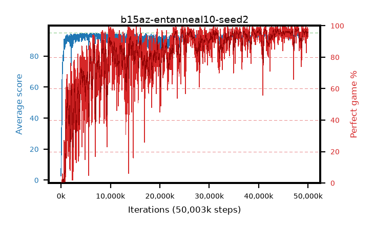

# b15az-entanneal10-seed2

step **50,003,968** · 3052 evals · trailing **93.95** · peak **94.41** @47,824,896 · sef **71.0** · best30 **97.4** @48,103,424

## Config

| | |
|---|---|
| algo | ppo |
| collect_envs | 128 |
| discount | 0.99 |
| eval_interval | 16384 |
| eval_queue | True |
| eval_queue_depth | 16 |
| eval_workers | 8 |
| fc_layers | (320,) |
| graph_eval_episodes | 100 |
| max_steps | 50003968 |
| min_checkpoint_score | 40.0 |
| ppo_adam_epsilon | 1e-07 |
| ppo_anneal_fraction | 1.0 |
| ppo_clip | 0.2 |
| ppo_clip_final | None |
| ppo_entropy_coef | 0.1 |
| ppo_entropy_coef_final | 0.001 |
| ppo_epochs | 4 |
| ppo_gae_lambda | 0.98 |
| ppo_gradient_clipping | 0.5 |
| ppo_horizon | 33.6 |
| ppo_learning_rate | 0.0003 |
| ppo_learning_rate_final | None |
| ppo_minibatch | 256 |
| ppo_normalize_adv | True |
| ppo_rollout | 128 |
| ppo_target_kl | 0.0 |
| ppo_transitions_per_rollout | 16384 |
| ppo_value_loss | huber |
| ppo_vf_coef | 0.5 |
| seed | 2 |
| torch_threads | 1 |

## Evals

| step | avg score | trailing avg | min score | max score | avg reward | perfect % | epsilon |
|---|---|---|---|---|---|---|---|
| 16384 | 2.75 | 2.75 | 0.0 | 6.0 | -1.281 | 0.0 |  |
| 32768 | 11.9 | 18.47 | 4.0 | 28.0 | 6.91 | 0.0 |  |
| 49152 | 24.6 | 17.93 | 5.0 | 44.0 | 19.565 | 0.0 |  |
| ... | ... | ... | ... | ... | ... | ... | ... |
| 49823744 | 93.55 | 94.16 | 32.0 | 95.0 | 187.275 | 95.0 |  |
| 49840128 | 94.73 | 94.17 | 68.0 | 95.0 | 192.434 | 99.0 |  |
| 49856512 | 93.12 | 94.14 | 18.0 | 95.0 | 186.845 | 95.0 |  |
| 49872896 | 93.77 | 93.98 | 65.0 | 95.0 | 184.481 | 92.0 |  |
| 49889280 | 93.83 | 93.99 | 13.0 | 95.0 | 188.563 | 96.0 |  |
| 49905664 | 94.16 | 93.98 | 57.0 | 95.0 | 188.881 | 96.0 |  |
| 49922048 | 93.7 | 93.96 | 19.0 | 95.0 | 189.411 | 97.0 |  |
| 49938432 | 94.68 | 93.93 | 65.0 | 95.0 | 191.38 | 98.0 |  |
| 49954816 | 93.27 | 93.94 | 9.0 | 95.0 | 186.909 | 95.0 |  |
| 49971200 | 93.7 | 93.93 | 12.0 | 95.0 | 189.414 | 97.0 |  |
| 49987584 | 93.88 | 93.96 | 21.0 | 95.0 | 188.552 | 96.0 |  |
| 50003968 | 93.66 | 93.95 | 62.0 | 95.0 | 185.372 | 93.0 |  |
