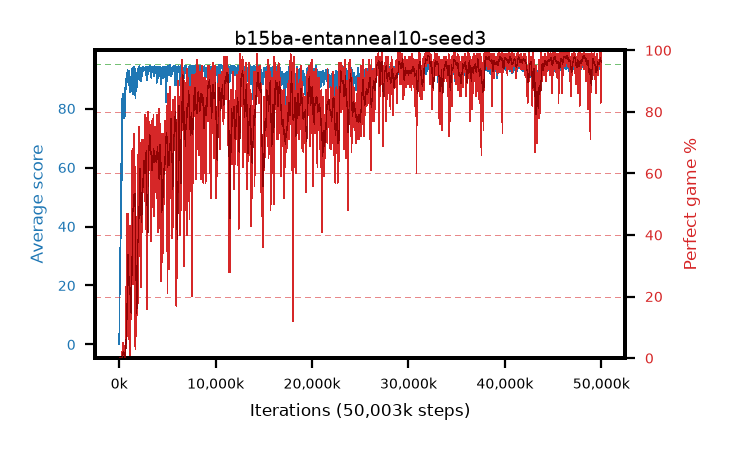

# b15ba-entanneal10-seed3

step **50,003,968** · 3052 evals · trailing **94.06** · peak **94.51** @46,481,408 · sef **72.0** · best30 **97.9** @46,448,640

## Config

| | |
|---|---|
| algo | ppo |
| collect_envs | 128 |
| discount | 0.99 |
| eval_interval | 16384 |
| eval_queue | True |
| eval_queue_depth | 16 |
| eval_workers | 8 |
| fc_layers | (320,) |
| graph_eval_episodes | 100 |
| max_steps | 50003968 |
| min_checkpoint_score | 40.0 |
| ppo_adam_epsilon | 1e-07 |
| ppo_anneal_fraction | 1.0 |
| ppo_clip | 0.2 |
| ppo_clip_final | None |
| ppo_entropy_coef | 0.1 |
| ppo_entropy_coef_final | 0.001 |
| ppo_epochs | 4 |
| ppo_gae_lambda | 0.98 |
| ppo_gradient_clipping | 0.5 |
| ppo_horizon | 33.6 |
| ppo_learning_rate | 0.0003 |
| ppo_learning_rate_final | None |
| ppo_minibatch | 256 |
| ppo_normalize_adv | True |
| ppo_rollout | 128 |
| ppo_target_kl | 0.0 |
| ppo_transitions_per_rollout | 16384 |
| ppo_value_loss | huber |
| ppo_vf_coef | 0.5 |
| seed | 3 |
| torch_threads | 1 |

## Evals

| step | avg score | trailing avg | min score | max score | avg reward | perfect % | epsilon |
|---|---|---|---|---|---|---|---|
| 16384 | 0.12 | 0.12 | 0.0 | 2.0 | -2.537 | 0.0 |  |
| 32768 | 5.98 | 16.75 | 1.0 | 25.0 | 3.793 | 0.0 |  |
| 49152 | 22.23 | 19.84 | 0.0 | 40.0 | 17.535 | 0.0 |  |
| ... | ... | ... | ... | ... | ... | ... | ... |
| 49823744 | 94.61 | 93.69 | 56.0 | 95.0 | 192.326 | 99.0 |  |
| 49840128 | 94.25 | 93.82 | 58.0 | 95.0 | 189.965 | 97.0 |  |
| 49856512 | 94.15 | 93.83 | 56.0 | 95.0 | 189.856 | 97.0 |  |
| 49872896 | 94.35 | 93.83 | 56.0 | 95.0 | 191.016 | 98.0 |  |
| 49889280 | 95.0 | 93.88 | 95.0 | 95.0 | 193.692 | 100.0 |  |
| 49905664 | 94.31 | 93.93 | 58.0 | 95.0 | 191.02 | 98.0 |  |
| 49922048 | 94.31 | 94.04 | 56.0 | 95.0 | 191.023 | 98.0 |  |
| 49938432 | 94.51 | 93.98 | 62.0 | 95.0 | 175.573 | 83.0 |  |
| 49954816 | 94.66 | 93.98 | 78.0 | 95.0 | 191.318 | 98.0 |  |
| 49971200 | 95.0 | 94.0 | 95.0 | 95.0 | 193.718 | 100.0 |  |
| 49987584 | 93.06 | 94.03 | 20.0 | 95.0 | 184.78 | 93.0 |  |
| 50003968 | 94.65 | 94.06 | 60.0 | 95.0 | 192.359 | 99.0 |  |
