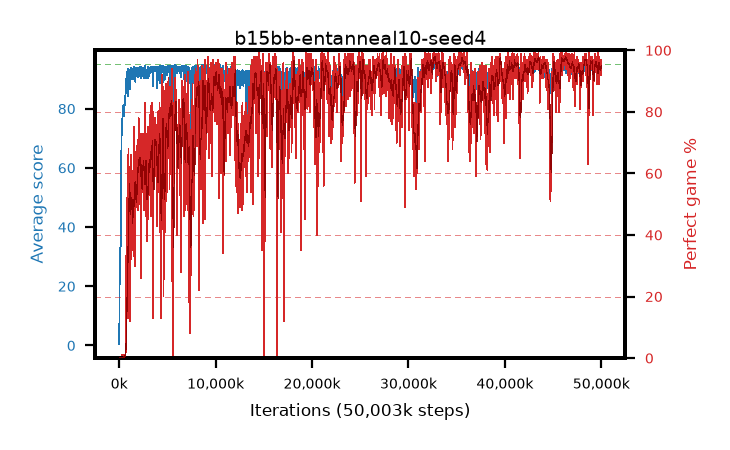

# b15bb-entanneal10-seed4

step **50,003,968** · 3052 evals · trailing **93.03** · peak **94.11** @43,433,984 · sef **72.1** · best30 **97.2** @46,383,104

## Config

| | |
|---|---|
| algo | ppo |
| collect_envs | 128 |
| discount | 0.99 |
| eval_interval | 16384 |
| eval_queue | True |
| eval_queue_depth | 16 |
| eval_workers | 8 |
| fc_layers | (320,) |
| graph_eval_episodes | 100 |
| max_steps | 50003968 |
| min_checkpoint_score | 40.0 |
| ppo_adam_epsilon | 1e-07 |
| ppo_anneal_fraction | 1.0 |
| ppo_clip | 0.2 |
| ppo_clip_final | None |
| ppo_entropy_coef | 0.1 |
| ppo_entropy_coef_final | 0.001 |
| ppo_epochs | 4 |
| ppo_gae_lambda | 0.98 |
| ppo_gradient_clipping | 0.5 |
| ppo_horizon | 33.6 |
| ppo_learning_rate | 0.0003 |
| ppo_learning_rate_final | None |
| ppo_minibatch | 256 |
| ppo_normalize_adv | True |
| ppo_rollout | 128 |
| ppo_target_kl | 0.0 |
| ppo_transitions_per_rollout | 16384 |
| ppo_value_loss | huber |
| ppo_vf_coef | 0.5 |
| seed | 4 |
| torch_threads | 1 |

## Evals

| step | avg score | trailing avg | min score | max score | avg reward | perfect % | epsilon |
|---|---|---|---|---|---|---|---|
| 16384 | 0.45 | 0.45 | 0.0 | 2.0 | -0.776 | 0.0 |  |
| 32768 | 16.1 | 13.67 | 2.0 | 30.0 | 11.231 | 0.0 |  |
| 49152 | 24.44 | 16.37 | 7.0 | 45.0 | 19.411 | 0.0 |  |
| ... | ... | ... | ... | ... | ... | ... | ... |
| 49823744 | 91.35 | 93.53 | 1.0 | 95.0 | 183.08 | 93.0 |  |
| 49840128 | 92.41 | 93.24 | 3.0 | 95.0 | 185.138 | 94.0 |  |
| 49856512 | 93.42 | 93.24 | 7.0 | 95.0 | 189.136 | 97.0 |  |
| 49872896 | 93.26 | 93.22 | 7.0 | 95.0 | 188.891 | 97.0 |  |
| 49889280 | 92.41 | 93.16 | 4.0 | 95.0 | 185.097 | 94.0 |  |
| 49905664 | 91.89 | 93.07 | 7.0 | 95.0 | 184.58 | 94.0 |  |
| 49922048 | 92.81 | 93.02 | 3.0 | 95.0 | 184.496 | 93.0 |  |
| 49938432 | 93.51 | 93.04 | 22.0 | 95.0 | 186.144 | 94.0 |  |
| 49954816 | 93.89 | 93.01 | 40.0 | 95.0 | 187.571 | 95.0 |  |
| 49971200 | 93.04 | 92.99 | 3.0 | 95.0 | 188.764 | 97.0 |  |
| 49987584 | 92.93 | 92.96 | 29.0 | 95.0 | 183.521 | 92.0 |  |
| 50003968 | 94.63 | 93.03 | 71.0 | 95.0 | 190.291 | 97.0 |  |
