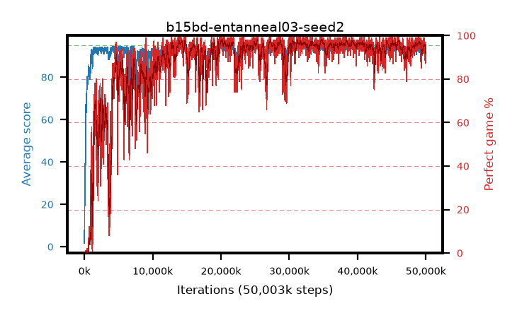

# b15bd-entanneal03-seed2

step **50,003,968** · 3052 evals · trailing **93.74** · peak **94.37** @34,979,840 · sef **83.9** · best30 **97.4** @34,979,840

## Config

| | |
|---|---|
| algo | ppo |
| collect_envs | 128 |
| discount | 0.99 |
| eval_interval | 16384 |
| eval_queue | True |
| eval_queue_depth | 16 |
| eval_workers | 8 |
| fc_layers | (320,) |
| graph_eval_episodes | 100 |
| max_steps | 50003968 |
| min_checkpoint_score | 40.0 |
| ppo_adam_epsilon | 1e-07 |
| ppo_anneal_fraction | 1.0 |
| ppo_clip | 0.2 |
| ppo_clip_final | None |
| ppo_entropy_coef | 0.03 |
| ppo_entropy_coef_final | 0.001 |
| ppo_epochs | 4 |
| ppo_gae_lambda | 0.98 |
| ppo_gradient_clipping | 0.5 |
| ppo_horizon | 33.6 |
| ppo_learning_rate | 0.0003 |
| ppo_learning_rate_final | None |
| ppo_minibatch | 256 |
| ppo_normalize_adv | True |
| ppo_rollout | 128 |
| ppo_target_kl | 0.0 |
| ppo_transitions_per_rollout | 16384 |
| ppo_value_loss | huber |
| ppo_vf_coef | 0.5 |
| seed | 2 |
| torch_threads | 1 |

## Evals

| step | avg score | trailing avg | min score | max score | avg reward | perfect % | epsilon |
|---|---|---|---|---|---|---|---|
| 16384 | 1.68 | 1.68 | 0.0 | 6.0 | -0.834 | 0.0 |  |
| 32768 | 12.12 | 6.9 | 4.0 | 23.0 | 7.177 | 0.0 |  |
| 49152 | 22.42 | 12.07 | 8.0 | 35.0 | 17.389 | 0.0 |  |
| ... | ... | ... | ... | ... | ... | ... | ... |
| 49823744 | 93.09 | 93.93 | 12.0 | 95.0 | 182.817 | 91.0 |  |
| 49840128 | 93.77 | 93.84 | 8.0 | 95.0 | 189.484 | 97.0 |  |
| 49856512 | 92.92 | 93.83 | 1.0 | 95.0 | 186.638 | 95.0 |  |
| 49872896 | 93.42 | 93.79 | 14.0 | 95.0 | 186.146 | 94.0 |  |
| 49889280 | 93.44 | 93.84 | 69.0 | 95.0 | 183.151 | 91.0 |  |
| 49905664 | 91.52 | 93.84 | 18.0 | 95.0 | 178.223 | 88.0 |  |
| 49922048 | 91.95 | 93.79 | 17.0 | 95.0 | 177.677 | 87.0 |  |
| 49938432 | 93.94 | 93.82 | 64.0 | 95.0 | 182.647 | 90.0 |  |
| 49954816 | 91.75 | 93.79 | 3.0 | 95.0 | 182.487 | 92.0 |  |
| 49971200 | 94.33 | 93.77 | 77.0 | 95.0 | 187.041 | 94.0 |  |
| 49987584 | 93.74 | 93.78 | 9.0 | 95.0 | 188.446 | 96.0 |  |
| 50003968 | 93.27 | 93.74 | 5.0 | 95.0 | 187.986 | 96.0 |  |
