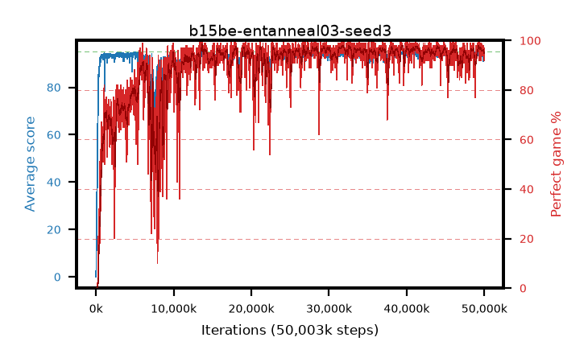

# b15be-entanneal03-seed3

step **50,003,968** · 3052 evals · trailing **93.49** · peak **94.42** @41,140,224 · sef **84.9** · best30 **97.4** @31,899,648

## Config

| | |
|---|---|
| algo | ppo |
| collect_envs | 128 |
| discount | 0.99 |
| eval_interval | 16384 |
| eval_queue | True |
| eval_queue_depth | 16 |
| eval_workers | 8 |
| fc_layers | (320,) |
| graph_eval_episodes | 100 |
| max_steps | 50003968 |
| min_checkpoint_score | 40.0 |
| ppo_adam_epsilon | 1e-07 |
| ppo_anneal_fraction | 1.0 |
| ppo_clip | 0.2 |
| ppo_clip_final | None |
| ppo_entropy_coef | 0.03 |
| ppo_entropy_coef_final | 0.001 |
| ppo_epochs | 4 |
| ppo_gae_lambda | 0.98 |
| ppo_gradient_clipping | 0.5 |
| ppo_horizon | 33.6 |
| ppo_learning_rate | 0.0003 |
| ppo_learning_rate_final | None |
| ppo_minibatch | 256 |
| ppo_normalize_adv | True |
| ppo_rollout | 128 |
| ppo_target_kl | 0.0 |
| ppo_transitions_per_rollout | 16384 |
| ppo_value_loss | huber |
| ppo_vf_coef | 0.5 |
| seed | 3 |
| torch_threads | 1 |

## Evals

| step | avg score | trailing avg | min score | max score | avg reward | perfect % | epsilon |
|---|---|---|---|---|---|---|---|
| 16384 | 0.01 | 0.01 | 0.0 | 1.0 | -3.926 | 0.0 |  |
| 32768 | 4.06 | 2.03 | 1.0 | 13.0 | 2.918 | 0.0 |  |
| 49152 | 18.1 | 7.39 | 0.0 | 39.0 | 13.542 | 0.0 |  |
| ... | ... | ... | ... | ... | ... | ... | ... |
| 49823744 | 92.17 | 93.75 | 5.0 | 95.0 | 186.913 | 96.0 |  |
| 49840128 | 92.74 | 93.61 | 18.0 | 95.0 | 186.445 | 95.0 |  |
| 49856512 | 94.13 | 93.52 | 32.0 | 95.0 | 188.859 | 96.0 |  |
| 49872896 | 93.66 | 93.51 | 17.0 | 95.0 | 186.398 | 94.0 |  |
| 49889280 | 93.67 | 93.62 | 22.0 | 95.0 | 188.407 | 96.0 |  |
| 49905664 | 90.88 | 93.64 | 9.0 | 95.0 | 183.625 | 94.0 |  |
| 49922048 | 93.98 | 93.63 | 5.0 | 95.0 | 190.703 | 98.0 |  |
| 49938432 | 92.36 | 93.53 | 5.0 | 95.0 | 183.111 | 92.0 |  |
| 49954816 | 94.22 | 93.51 | 63.0 | 95.0 | 188.945 | 96.0 |  |
| 49971200 | 92.33 | 93.48 | 3.0 | 95.0 | 185.062 | 94.0 |  |
| 49987584 | 92.78 | 93.48 | 7.0 | 95.0 | 184.436 | 93.0 |  |
| 50003968 | 92.8 | 93.49 | 16.0 | 95.0 | 188.52 | 97.0 |  |
