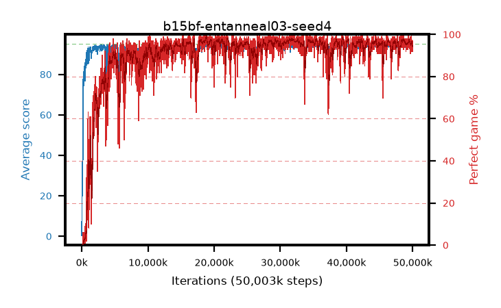

# b15bf-entanneal03-seed4

step **50,003,968** · 3052 evals · trailing **94.15** · peak **94.52** @34,553,856 · sef **90.0** · best30 **97.7** @31,670,272

## Config

| | |
|---|---|
| algo | ppo |
| collect_envs | 128 |
| discount | 0.99 |
| eval_interval | 16384 |
| eval_queue | True |
| eval_queue_depth | 16 |
| eval_workers | 8 |
| fc_layers | (320,) |
| graph_eval_episodes | 100 |
| max_steps | 50003968 |
| min_checkpoint_score | 40.0 |
| ppo_adam_epsilon | 1e-07 |
| ppo_anneal_fraction | 1.0 |
| ppo_clip | 0.2 |
| ppo_clip_final | None |
| ppo_entropy_coef | 0.03 |
| ppo_entropy_coef_final | 0.001 |
| ppo_epochs | 4 |
| ppo_gae_lambda | 0.98 |
| ppo_gradient_clipping | 0.5 |
| ppo_horizon | 33.6 |
| ppo_learning_rate | 0.0003 |
| ppo_learning_rate_final | None |
| ppo_minibatch | 256 |
| ppo_normalize_adv | True |
| ppo_rollout | 128 |
| ppo_target_kl | 0.0 |
| ppo_transitions_per_rollout | 16384 |
| ppo_value_loss | huber |
| ppo_vf_coef | 0.5 |
| seed | 4 |
| torch_threads | 1 |

## Evals

| step | avg score | trailing avg | min score | max score | avg reward | perfect % | epsilon |
|---|---|---|---|---|---|---|---|
| 16384 | 0.34 | 0.34 | 0.0 | 3.0 | -0.661 | 0.0 |  |
| 32768 | 13.8 | 7.07 | 1.0 | 29.0 | 9.719 | 0.0 |  |
| 49152 | 23.71 | 12.62 | 7.0 | 49.0 | 18.677 | 0.0 |  |
| ... | ... | ... | ... | ... | ... | ... | ... |
| 49823744 | 94.67 | 94.3 | 79.0 | 95.0 | 190.391 | 97.0 |  |
| 49840128 | 94.48 | 94.19 | 70.0 | 95.0 | 189.197 | 96.0 |  |
| 49856512 | 94.37 | 94.22 | 79.0 | 95.0 | 187.103 | 94.0 |  |
| 49872896 | 94.04 | 94.28 | 68.0 | 95.0 | 185.766 | 93.0 |  |
| 49889280 | 94.25 | 94.24 | 75.0 | 95.0 | 186.972 | 94.0 |  |
| 49905664 | 93.99 | 94.19 | 76.0 | 95.0 | 184.719 | 92.0 |  |
| 49922048 | 93.74 | 94.24 | 70.0 | 95.0 | 184.427 | 92.0 |  |
| 49938432 | 94.5 | 94.22 | 71.0 | 95.0 | 190.22 | 97.0 |  |
| 49954816 | 94.3 | 94.19 | 63.0 | 95.0 | 188.014 | 95.0 |  |
| 49971200 | 94.31 | 94.21 | 62.0 | 95.0 | 188.025 | 95.0 |  |
| 49987584 | 94.48 | 94.21 | 76.0 | 95.0 | 190.185 | 97.0 |  |
| 50003968 | 92.76 | 94.15 | 12.0 | 95.0 | 183.438 | 92.0 |  |
