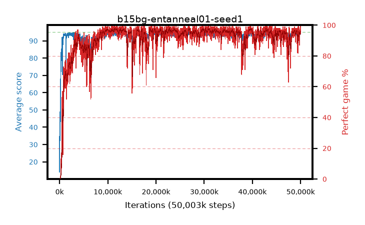

# b15bg-entanneal01-seed1

step **50,003,968** · 3052 evals · trailing **94.23** · peak **94.41** @43,204,608 · sef **91.6** · best30 **97.5** @11,829,248

## Config

| | |
|---|---|
| algo | ppo |
| collect_envs | 128 |
| discount | 0.99 |
| eval_interval | 16384 |
| eval_queue | True |
| eval_queue_depth | 16 |
| eval_workers | 8 |
| fc_layers | (320,) |
| graph_eval_episodes | 100 |
| max_steps | 50003968 |
| min_checkpoint_score | 40.0 |
| ppo_adam_epsilon | 1e-07 |
| ppo_anneal_fraction | 1.0 |
| ppo_clip | 0.2 |
| ppo_clip_final | None |
| ppo_entropy_coef | 0.01 |
| ppo_entropy_coef_final | 0.001 |
| ppo_epochs | 4 |
| ppo_gae_lambda | 0.98 |
| ppo_gradient_clipping | 0.5 |
| ppo_horizon | 33.6 |
| ppo_learning_rate | 0.0003 |
| ppo_learning_rate_final | None |
| ppo_minibatch | 256 |
| ppo_normalize_adv | True |
| ppo_rollout | 128 |
| ppo_target_kl | 0.0 |
| ppo_transitions_per_rollout | 16384 |
| ppo_value_loss | huber |
| ppo_vf_coef | 0.5 |
| seed | 1 |
| torch_threads | 1 |

## Evals

| step | avg score | trailing avg | min score | max score | avg reward | perfect % | epsilon |
|---|---|---|---|---|---|---|---|
| 16384 | 14.08 | 29.6 | 2.0 | 49.0 | 12.389 | 0.0 |  |
| 32768 | 48.87 | 34.86 | 25.0 | 76.0 | 43.818 | 0.0 |  |
| 49152 | 37.39 | 34.84 | 12.0 | 70.0 | 32.347 | 0.0 |  |
| ... | ... | ... | ... | ... | ... | ... | ... |
| 49823744 | 94.55 | 94.11 | 74.0 | 95.0 | 189.207 | 96.0 |  |
| 49840128 | 94.16 | 94.1 | 36.0 | 95.0 | 189.806 | 97.0 |  |
| 49856512 | 94.45 | 94.13 | 56.0 | 95.0 | 189.158 | 96.0 |  |
| 49872896 | 93.76 | 93.75 | 67.0 | 95.0 | 186.436 | 94.0 |  |
| 49889280 | 94.7 | 93.76 | 83.0 | 95.0 | 189.401 | 96.0 |  |
| 49905664 | 94.21 | 93.78 | 41.0 | 95.0 | 189.882 | 97.0 |  |
| 49922048 | 94.35 | 93.84 | 67.0 | 95.0 | 187.058 | 94.0 |  |
| 49938432 | 94.91 | 94.01 | 92.0 | 95.0 | 189.624 | 96.0 |  |
| 49954816 | 93.9 | 93.91 | 22.0 | 95.0 | 187.574 | 95.0 |  |
| 49971200 | 94.62 | 94.14 | 81.0 | 95.0 | 189.334 | 96.0 |  |
| 49987584 | 94.59 | 94.18 | 71.0 | 95.0 | 190.294 | 97.0 |  |
| 50003968 | 94.91 | 94.23 | 86.0 | 95.0 | 192.625 | 99.0 |  |
