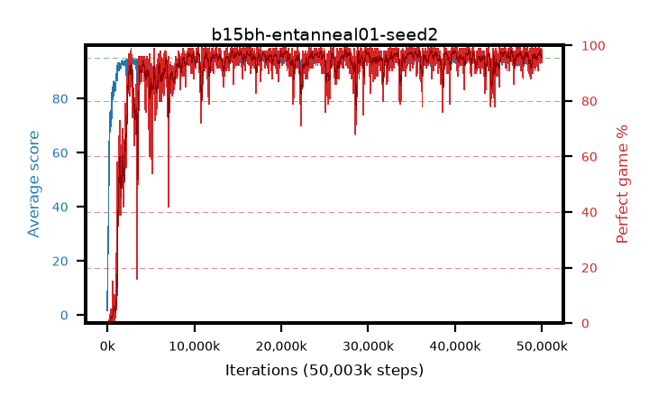

# b15bh-entanneal01-seed2

step **50,003,968** · 3052 evals · trailing **94.16** · peak **94.53** @27,607,040 · sef **93.2** · best30 **97.7** @40,042,496

## Config

| | |
|---|---|
| algo | ppo |
| collect_envs | 128 |
| discount | 0.99 |
| eval_interval | 16384 |
| eval_queue | True |
| eval_queue_depth | 16 |
| eval_workers | 8 |
| fc_layers | (320,) |
| graph_eval_episodes | 100 |
| max_steps | 50003968 |
| min_checkpoint_score | 40.0 |
| ppo_adam_epsilon | 1e-07 |
| ppo_anneal_fraction | 1.0 |
| ppo_clip | 0.2 |
| ppo_clip_final | None |
| ppo_entropy_coef | 0.01 |
| ppo_entropy_coef_final | 0.001 |
| ppo_epochs | 4 |
| ppo_gae_lambda | 0.98 |
| ppo_gradient_clipping | 0.5 |
| ppo_horizon | 33.6 |
| ppo_learning_rate | 0.0003 |
| ppo_learning_rate_final | None |
| ppo_minibatch | 256 |
| ppo_normalize_adv | True |
| ppo_rollout | 128 |
| ppo_target_kl | 0.0 |
| ppo_transitions_per_rollout | 16384 |
| ppo_value_loss | huber |
| ppo_vf_coef | 0.5 |
| seed | 2 |
| torch_threads | 1 |

## Evals

| step | avg score | trailing avg | min score | max score | avg reward | perfect % | epsilon |
|---|---|---|---|---|---|---|---|
| 16384 | 1.68 | 1.68 | 0.0 | 7.0 | -0.969 | 0.0 |  |
| 32768 | 16.36 | 19.06 | 5.0 | 35.0 | 11.483 | 0.0 |  |
| 49152 | 26.44 | 14.06 | 3.0 | 46.0 | 21.439 | 0.0 |  |
| ... | ... | ... | ... | ... | ... | ... | ... |
| 49823744 | 93.14 | 93.91 | 22.0 | 95.0 | 186.746 | 95.0 |  |
| 49840128 | 93.8 | 93.89 | 23.0 | 95.0 | 188.448 | 96.0 |  |
| 49856512 | 94.49 | 94.03 | 60.0 | 95.0 | 189.151 | 96.0 |  |
| 49872896 | 94.36 | 94.03 | 69.0 | 95.0 | 187.02 | 94.0 |  |
| 49889280 | 93.81 | 94.06 | 24.0 | 95.0 | 187.52 | 95.0 |  |
| 49905664 | 94.35 | 94.05 | 57.0 | 95.0 | 189.012 | 96.0 |  |
| 49922048 | 94.71 | 94.11 | 66.0 | 95.0 | 192.384 | 99.0 |  |
| 49938432 | 94.48 | 94.19 | 70.0 | 95.0 | 189.08 | 96.0 |  |
| 49954816 | 93.58 | 94.16 | 6.0 | 95.0 | 187.279 | 95.0 |  |
| 49971200 | 94.45 | 94.17 | 70.0 | 95.0 | 188.151 | 95.0 |  |
| 49987584 | 93.76 | 94.16 | 8.0 | 95.0 | 187.479 | 95.0 |  |
| 50003968 | 93.38 | 94.16 | 26.0 | 95.0 | 186.056 | 94.0 |  |
