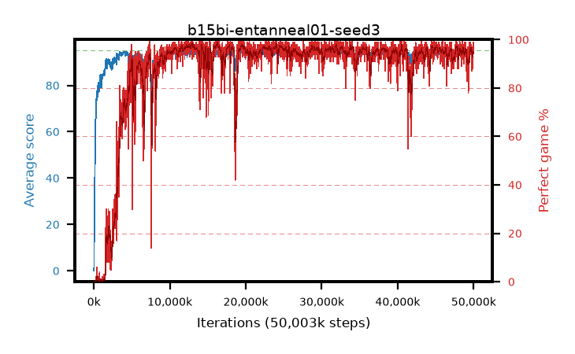

# b15bi-entanneal01-seed3

step **50,003,968** · 3052 evals · trailing **94.15** · peak **94.4** @12,910,592 · sef **87.8** · best30 **97.7** @16,465,920

## Config

| | |
|---|---|
| algo | ppo |
| collect_envs | 128 |
| discount | 0.99 |
| eval_interval | 16384 |
| eval_queue | True |
| eval_queue_depth | 16 |
| eval_workers | 8 |
| fc_layers | (320,) |
| graph_eval_episodes | 100 |
| max_steps | 50003968 |
| min_checkpoint_score | 40.0 |
| ppo_adam_epsilon | 1e-07 |
| ppo_anneal_fraction | 1.0 |
| ppo_clip | 0.2 |
| ppo_clip_final | None |
| ppo_entropy_coef | 0.01 |
| ppo_entropy_coef_final | 0.001 |
| ppo_epochs | 4 |
| ppo_gae_lambda | 0.98 |
| ppo_gradient_clipping | 0.5 |
| ppo_horizon | 33.6 |
| ppo_learning_rate | 0.0003 |
| ppo_learning_rate_final | None |
| ppo_minibatch | 256 |
| ppo_normalize_adv | True |
| ppo_rollout | 128 |
| ppo_target_kl | 0.0 |
| ppo_transitions_per_rollout | 16384 |
| ppo_value_loss | huber |
| ppo_vf_coef | 0.5 |
| seed | 3 |
| torch_threads | 1 |

## Evals

| step | avg score | trailing avg | min score | max score | avg reward | perfect % | epsilon |
|---|---|---|---|---|---|---|---|
| 16384 | 0.05 | 0.05 | 0.0 | 1.0 | -2.414 | 0.0 |  |
| 32768 | 2.1 | 1.07 | 0.0 | 9.0 | 1.444 | 0.0 |  |
| 49152 | 17.57 | 6.57 | 0.0 | 32.0 | 13.062 | 0.0 |  |
| ... | ... | ... | ... | ... | ... | ... | ... |
| 49823744 | 92.88 | 94.11 | 6.0 | 95.0 | 186.583 | 95.0 |  |
| 49840128 | 94.19 | 94.12 | 20.0 | 95.0 | 189.883 | 97.0 |  |
| 49856512 | 94.48 | 94.15 | 66.0 | 95.0 | 189.145 | 96.0 |  |
| 49872896 | 93.96 | 93.95 | 56.0 | 95.0 | 185.667 | 93.0 |  |
| 49889280 | 92.3 | 93.96 | 16.0 | 95.0 | 179.032 | 88.0 |  |
| 49905664 | 94.43 | 94.12 | 81.0 | 95.0 | 187.126 | 94.0 |  |
| 49922048 | 94.35 | 94.03 | 78.0 | 95.0 | 187.044 | 94.0 |  |
| 49938432 | 94.73 | 94.17 | 87.0 | 95.0 | 188.417 | 95.0 |  |
| 49954816 | 94.73 | 94.15 | 70.0 | 95.0 | 191.43 | 98.0 |  |
| 49971200 | 93.71 | 94.13 | 36.0 | 95.0 | 187.425 | 95.0 |  |
| 49987584 | 94.71 | 94.18 | 66.0 | 95.0 | 192.401 | 99.0 |  |
| 50003968 | 94.16 | 94.15 | 32.0 | 95.0 | 189.875 | 97.0 |  |
