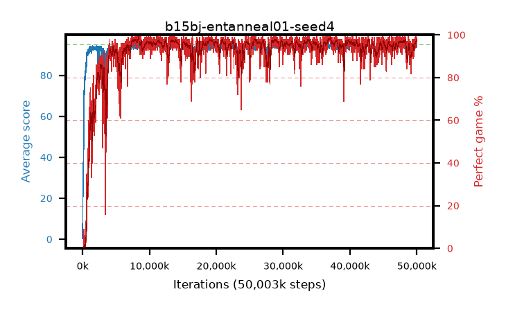

# b15bj-entanneal01-seed4

step **50,003,968** · 3052 evals · trailing **93.97** · peak **94.5** @33,685,504 · sef **93.1** · best30 **98.2** @37,126,144

## Config

| | |
|---|---|
| algo | ppo |
| collect_envs | 128 |
| discount | 0.99 |
| eval_interval | 16384 |
| eval_queue | True |
| eval_queue_depth | 16 |
| eval_workers | 8 |
| fc_layers | (320,) |
| graph_eval_episodes | 100 |
| max_steps | 50003968 |
| min_checkpoint_score | 40.0 |
| ppo_adam_epsilon | 1e-07 |
| ppo_anneal_fraction | 1.0 |
| ppo_clip | 0.2 |
| ppo_clip_final | None |
| ppo_entropy_coef | 0.01 |
| ppo_entropy_coef_final | 0.001 |
| ppo_epochs | 4 |
| ppo_gae_lambda | 0.98 |
| ppo_gradient_clipping | 0.5 |
| ppo_horizon | 33.6 |
| ppo_learning_rate | 0.0003 |
| ppo_learning_rate_final | None |
| ppo_minibatch | 256 |
| ppo_normalize_adv | True |
| ppo_rollout | 128 |
| ppo_target_kl | 0.0 |
| ppo_transitions_per_rollout | 16384 |
| ppo_value_loss | huber |
| ppo_vf_coef | 0.5 |
| seed | 4 |
| torch_threads | 1 |

## Evals

| step | avg score | trailing avg | min score | max score | avg reward | perfect % | epsilon |
|---|---|---|---|---|---|---|---|
| 16384 | 0.29 | 0.29 | 0.0 | 2.0 | -0.707 | 0.0 |  |
| 32768 | 12.29 | 16.3 | 1.0 | 30.0 | 8.625 | 0.0 |  |
| 49152 | 24.8 | 12.54 | 8.0 | 45.0 | 19.765 | 0.0 |  |
| ... | ... | ... | ... | ... | ... | ... | ... |
| 49823744 | 94.93 | 93.91 | 88.0 | 95.0 | 192.62 | 99.0 |  |
| 49840128 | 94.88 | 93.91 | 83.0 | 95.0 | 192.585 | 99.0 |  |
| 49856512 | 94.28 | 93.9 | 38.0 | 95.0 | 190.994 | 98.0 |  |
| 49872896 | 94.52 | 93.91 | 68.0 | 95.0 | 190.217 | 97.0 |  |
| 49889280 | 94.93 | 93.97 | 92.0 | 95.0 | 190.635 | 97.0 |  |
| 49905664 | 94.31 | 93.97 | 26.0 | 95.0 | 191.985 | 99.0 |  |
| 49922048 | 94.64 | 93.9 | 59.0 | 95.0 | 192.358 | 99.0 |  |
| 49938432 | 93.78 | 93.97 | 16.0 | 95.0 | 189.447 | 97.0 |  |
| 49954816 | 94.13 | 93.95 | 61.0 | 95.0 | 188.846 | 96.0 |  |
| 49971200 | 94.18 | 94.07 | 59.0 | 95.0 | 187.9 | 95.0 |  |
| 49987584 | 94.83 | 94.12 | 86.0 | 95.0 | 191.534 | 98.0 |  |
| 50003968 | 94.53 | 93.97 | 61.0 | 95.0 | 191.247 | 98.0 |  |
