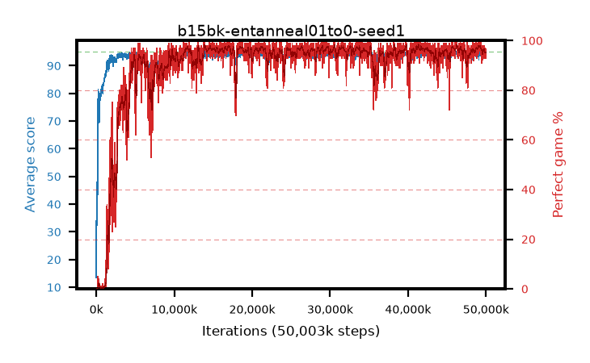

# b15bk-entanneal01to0-seed1

step **50,003,968** · 3052 evals · trailing **94.1** · peak **94.48** @31,866,880 · sef **90.6** · best30 **97.5** @41,385,984

## Config

| | |
|---|---|
| algo | ppo |
| collect_envs | 128 |
| discount | 0.99 |
| eval_interval | 16384 |
| eval_queue | True |
| eval_queue_depth | 16 |
| eval_workers | 8 |
| fc_layers | (320,) |
| graph_eval_episodes | 100 |
| max_steps | 50003968 |
| min_checkpoint_score | 40.0 |
| ppo_adam_epsilon | 1e-07 |
| ppo_anneal_fraction | 1.0 |
| ppo_clip | 0.2 |
| ppo_clip_final | None |
| ppo_entropy_coef | 0.01 |
| ppo_entropy_coef_final | 0.0 |
| ppo_epochs | 4 |
| ppo_gae_lambda | 0.98 |
| ppo_gradient_clipping | 0.5 |
| ppo_horizon | 33.6 |
| ppo_learning_rate | 0.0003 |
| ppo_learning_rate_final | None |
| ppo_minibatch | 256 |
| ppo_normalize_adv | True |
| ppo_rollout | 128 |
| ppo_target_kl | 0.0 |
| ppo_transitions_per_rollout | 16384 |
| ppo_value_loss | huber |
| ppo_vf_coef | 0.5 |
| seed | 1 |
| torch_threads | 1 |

## Evals

| step | avg score | trailing avg | min score | max score | avg reward | perfect % | epsilon |
|---|---|---|---|---|---|---|---|
| 16384 | 13.5 | 27.92 | 1.0 | 32.0 | 12.255 | 0.0 |  |
| 32768 | 48.02 | 34.12 | 4.0 | 83.0 | 42.929 | 0.0 |  |
| 49152 | 37.84 | 35.13 | 10.0 | 70.0 | 32.749 | 0.0 |  |
| ... | ... | ... | ... | ... | ... | ... | ... |
| 49823744 | 94.08 | 94.26 | 74.0 | 95.0 | 185.824 | 93.0 |  |
| 49840128 | 94.36 | 94.22 | 66.0 | 95.0 | 188.091 | 95.0 |  |
| 49856512 | 94.61 | 94.13 | 82.0 | 95.0 | 188.326 | 95.0 |  |
| 49872896 | 94.83 | 94.21 | 87.0 | 95.0 | 190.508 | 97.0 |  |
| 49889280 | 94.6 | 94.23 | 80.0 | 95.0 | 189.314 | 96.0 |  |
| 49905664 | 94.52 | 94.21 | 78.0 | 95.0 | 188.236 | 95.0 |  |
| 49922048 | 94.44 | 94.21 | 69.0 | 95.0 | 190.106 | 97.0 |  |
| 49938432 | 93.64 | 94.19 | 18.0 | 95.0 | 187.286 | 95.0 |  |
| 49954816 | 93.44 | 94.09 | 12.0 | 95.0 | 186.087 | 94.0 |  |
| 49971200 | 93.6 | 94.08 | 6.0 | 95.0 | 188.314 | 96.0 |  |
| 49987584 | 94.36 | 94.1 | 82.0 | 95.0 | 186.052 | 93.0 |  |
| 50003968 | 93.68 | 94.1 | 40.0 | 95.0 | 186.327 | 94.0 |  |
