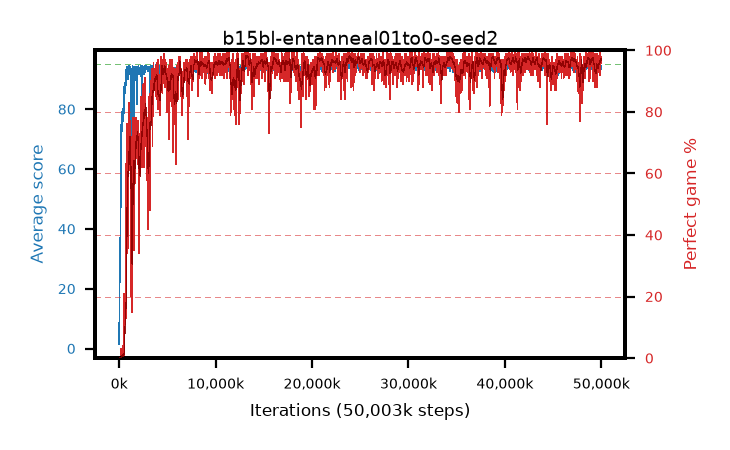

# b15bl-entanneal01to0-seed2

step **50,003,968** · 3052 evals · trailing **94.17** · peak **94.63** @24,182,784 · sef **93.3** · best30 **97.6** @24,182,784

## Config

| | |
|---|---|
| algo | ppo |
| collect_envs | 128 |
| discount | 0.99 |
| eval_interval | 16384 |
| eval_queue | True |
| eval_queue_depth | 16 |
| eval_workers | 8 |
| fc_layers | (320,) |
| graph_eval_episodes | 100 |
| max_steps | 50003968 |
| min_checkpoint_score | 40.0 |
| ppo_adam_epsilon | 1e-07 |
| ppo_anneal_fraction | 1.0 |
| ppo_clip | 0.2 |
| ppo_clip_final | None |
| ppo_entropy_coef | 0.01 |
| ppo_entropy_coef_final | 0.0 |
| ppo_epochs | 4 |
| ppo_gae_lambda | 0.98 |
| ppo_gradient_clipping | 0.5 |
| ppo_horizon | 33.6 |
| ppo_learning_rate | 0.0003 |
| ppo_learning_rate_final | None |
| ppo_minibatch | 256 |
| ppo_normalize_adv | True |
| ppo_rollout | 128 |
| ppo_target_kl | 0.0 |
| ppo_transitions_per_rollout | 16384 |
| ppo_value_loss | huber |
| ppo_vf_coef | 0.5 |
| seed | 2 |
| torch_threads | 1 |

## Evals

| step | avg score | trailing avg | min score | max score | avg reward | perfect % | epsilon |
|---|---|---|---|---|---|---|---|
| 16384 | 1.47 | 1.47 | 0.0 | 5.0 | -0.869 | 0.0 |  |
| 32768 | 14.09 | 7.78 | 4.0 | 24.0 | 9.218 | 0.0 |  |
| 49152 | 26.1 | 19.04 | 3.0 | 55.0 | 21.077 | 0.0 |  |
| ... | ... | ... | ... | ... | ... | ... | ... |
| 49823744 | 94.03 | 93.91 | 22.0 | 95.0 | 190.766 | 98.0 |  |
| 49840128 | 95.0 | 94.03 | 95.0 | 95.0 | 193.708 | 100.0 |  |
| 49856512 | 94.26 | 94.05 | 72.0 | 95.0 | 184.985 | 92.0 |  |
| 49872896 | 93.74 | 94.06 | 10.0 | 95.0 | 187.462 | 95.0 |  |
| 49889280 | 94.5 | 94.06 | 59.0 | 95.0 | 190.188 | 97.0 |  |
| 49905664 | 94.76 | 94.16 | 82.0 | 95.0 | 191.484 | 98.0 |  |
| 49922048 | 94.76 | 94.15 | 77.0 | 95.0 | 191.481 | 98.0 |  |
| 49938432 | 93.95 | 94.13 | 18.0 | 95.0 | 189.687 | 97.0 |  |
| 49954816 | 93.9 | 94.11 | 18.0 | 95.0 | 190.633 | 98.0 |  |
| 49971200 | 94.27 | 94.18 | 67.0 | 95.0 | 189.003 | 96.0 |  |
| 49987584 | 94.56 | 94.21 | 56.0 | 95.0 | 191.282 | 98.0 |  |
| 50003968 | 93.39 | 94.17 | 12.0 | 95.0 | 189.074 | 97.0 |  |
