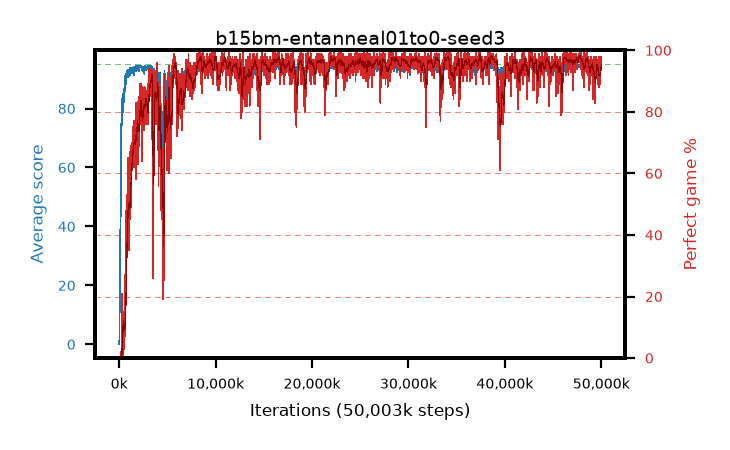

# b15bm-entanneal01to0-seed3

step **50,003,968** · 3052 evals · trailing **93.24** · peak **94.44** @47,136,768 · sef **92.1** · best30 **97.5** @38,879,232

## Config

| | |
|---|---|
| algo | ppo |
| collect_envs | 128 |
| discount | 0.99 |
| eval_interval | 16384 |
| eval_queue | True |
| eval_queue_depth | 16 |
| eval_workers | 8 |
| fc_layers | (320,) |
| graph_eval_episodes | 100 |
| max_steps | 50003968 |
| min_checkpoint_score | 40.0 |
| ppo_adam_epsilon | 1e-07 |
| ppo_anneal_fraction | 1.0 |
| ppo_clip | 0.2 |
| ppo_clip_final | None |
| ppo_entropy_coef | 0.01 |
| ppo_entropy_coef_final | 0.0 |
| ppo_epochs | 4 |
| ppo_gae_lambda | 0.98 |
| ppo_gradient_clipping | 0.5 |
| ppo_horizon | 33.6 |
| ppo_learning_rate | 0.0003 |
| ppo_learning_rate_final | None |
| ppo_minibatch | 256 |
| ppo_normalize_adv | True |
| ppo_rollout | 128 |
| ppo_target_kl | 0.0 |
| ppo_transitions_per_rollout | 16384 |
| ppo_value_loss | huber |
| ppo_vf_coef | 0.5 |
| seed | 3 |
| torch_threads | 1 |

## Evals

| step | avg score | trailing avg | min score | max score | avg reward | perfect % | epsilon |
|---|---|---|---|---|---|---|---|
| 16384 | 0.06 | 0.06 | 0.0 | 2.0 | -2.983 | 0.0 |  |
| 32768 | 1.89 | 0.97 | 0.0 | 7.0 | 1.282 | 0.0 |  |
| 49152 | 21.66 | 22.27 | 4.0 | 49.0 | 16.85 | 0.0 |  |
| ... | ... | ... | ... | ... | ... | ... | ... |
| 49823744 | 92.45 | 93.24 | 6.0 | 95.0 | 182.15 | 91.0 |  |
| 49840128 | 92.48 | 93.23 | 45.0 | 95.0 | 181.104 | 90.0 |  |
| 49856512 | 93.87 | 93.24 | 53.0 | 95.0 | 187.52 | 95.0 |  |
| 49872896 | 91.47 | 93.21 | 10.0 | 95.0 | 179.198 | 89.0 |  |
| 49889280 | 93.43 | 93.2 | 14.0 | 95.0 | 185.126 | 93.0 |  |
| 49905664 | 93.89 | 93.19 | 15.0 | 95.0 | 188.541 | 96.0 |  |
| 49922048 | 94.06 | 93.3 | 60.0 | 95.0 | 187.76 | 95.0 |  |
| 49938432 | 93.05 | 93.25 | 10.0 | 95.0 | 187.719 | 96.0 |  |
| 49954816 | 93.65 | 93.28 | 10.0 | 95.0 | 190.271 | 98.0 |  |
| 49971200 | 94.15 | 93.32 | 68.0 | 95.0 | 188.856 | 96.0 |  |
| 49987584 | 94.36 | 93.23 | 68.0 | 95.0 | 189.013 | 96.0 |  |
| 50003968 | 94.79 | 93.24 | 84.0 | 95.0 | 191.481 | 98.0 |  |
