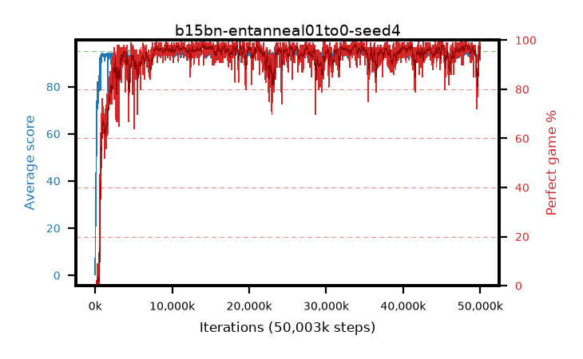

# b15bn-entanneal01to0-seed4

step **50,003,968** · 3052 evals · trailing **92.97** · peak **94.53** @48,250,880 · sef **94.5** · best30 **97.6** @48,414,720

## Config

| | |
|---|---|
| algo | ppo |
| collect_envs | 128 |
| discount | 0.99 |
| eval_interval | 16384 |
| eval_queue | True |
| eval_queue_depth | 16 |
| eval_workers | 8 |
| fc_layers | (320,) |
| graph_eval_episodes | 100 |
| max_steps | 50003968 |
| min_checkpoint_score | 40.0 |
| ppo_adam_epsilon | 1e-07 |
| ppo_anneal_fraction | 1.0 |
| ppo_clip | 0.2 |
| ppo_clip_final | None |
| ppo_entropy_coef | 0.01 |
| ppo_entropy_coef_final | 0.0 |
| ppo_epochs | 4 |
| ppo_gae_lambda | 0.98 |
| ppo_gradient_clipping | 0.5 |
| ppo_horizon | 33.6 |
| ppo_learning_rate | 0.0003 |
| ppo_learning_rate_final | None |
| ppo_minibatch | 256 |
| ppo_normalize_adv | True |
| ppo_rollout | 128 |
| ppo_target_kl | 0.0 |
| ppo_transitions_per_rollout | 16384 |
| ppo_value_loss | huber |
| ppo_vf_coef | 0.5 |
| seed | 4 |
| torch_threads | 1 |

## Evals

| step | avg score | trailing avg | min score | max score | avg reward | perfect % | epsilon |
|---|---|---|---|---|---|---|---|
| 16384 | 0.33 | 0.33 | 0.0 | 2.0 | -0.537 | 0.0 |  |
| 32768 | 17.13 | 19.07 | 1.0 | 37.0 | 12.62 | 0.0 |  |
| 49152 | 24.73 | 12.53 | 3.0 | 48.0 | 19.691 | 0.0 |  |
| ... | ... | ... | ... | ... | ... | ... | ... |
| 49823744 | 93.83 | 92.91 | 22.0 | 95.0 | 188.512 | 96.0 |  |
| 49840128 | 94.33 | 92.82 | 57.0 | 95.0 | 188.048 | 95.0 |  |
| 49856512 | 92.4 | 92.81 | 10.0 | 95.0 | 185.141 | 94.0 |  |
| 49872896 | 94.53 | 92.92 | 70.0 | 95.0 | 191.243 | 98.0 |  |
| 49889280 | 94.6 | 92.91 | 55.0 | 95.0 | 192.319 | 99.0 |  |
| 49905664 | 94.39 | 92.83 | 34.0 | 95.0 | 192.063 | 99.0 |  |
| 49922048 | 94.24 | 92.95 | 63.0 | 95.0 | 189.94 | 97.0 |  |
| 49938432 | 94.15 | 92.97 | 10.0 | 95.0 | 191.8 | 99.0 |  |
| 49954816 | 94.96 | 92.99 | 91.0 | 95.0 | 192.596 | 99.0 |  |
| 49971200 | 93.42 | 92.98 | 28.0 | 95.0 | 185.084 | 93.0 |  |
| 49987584 | 94.61 | 93.02 | 69.0 | 95.0 | 189.286 | 96.0 |  |
| 50003968 | 92.3 | 92.97 | 32.0 | 95.0 | 182.955 | 92.0 |  |
