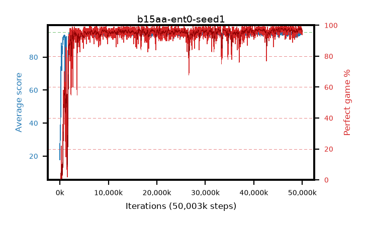

# b15aa-ent0-seed1

step **50,003,968** · 3052 evals · trailing **94.33** · peak **94.45** @46,252,032 · sef **96.1** · best30 **98.0** @45,973,504

## Config

| | |
|---|---|
| algo | ppo |
| collect_envs | 128 |
| discount | 0.99 |
| eval_interval | 16384 |
| eval_queue | True |
| eval_queue_depth | 16 |
| eval_workers | 8 |
| fc_layers | (320,) |
| graph_eval_episodes | 100 |
| max_steps | 50003968 |
| min_checkpoint_score | 40.0 |
| ppo_adam_epsilon | 1e-07 |
| ppo_anneal_fraction | 1.0 |
| ppo_clip | 0.2 |
| ppo_clip_final | None |
| ppo_entropy_coef | 0.0 |
| ppo_entropy_coef_final | None |
| ppo_epochs | 4 |
| ppo_gae_lambda | 0.98 |
| ppo_gradient_clipping | 0.5 |
| ppo_horizon | 33.6 |
| ppo_learning_rate | 0.0003 |
| ppo_learning_rate_final | None |
| ppo_minibatch | 256 |
| ppo_normalize_adv | True |
| ppo_rollout | 128 |
| ppo_target_kl | 0.0 |
| ppo_transitions_per_rollout | 16384 |
| ppo_value_loss | huber |
| ppo_vf_coef | 0.5 |
| seed | 1 |
| torch_threads | 1 |

## Evals

| step | avg score | trailing avg | min score | max score | avg reward | perfect % | epsilon |
|---|---|---|---|---|---|---|---|
| 16384 | 17.8 | 23.69 | 1.0 | 43.0 | 15.68 | 0.0 |  |
| 32768 | 34.31 | 30.1 | 1.0 | 88.0 | 30.795 | 0.0 |  |
| 49152 | 34.83 | 29.04 | 10.0 | 75.0 | 29.875 | 0.0 |  |
| ... | ... | ... | ... | ... | ... | ... | ... |
| 49823744 | 94.45 | 94.34 | 70.0 | 95.0 | 190.465 | 97.0 |  |
| 49840128 | 94.85 | 94.32 | 87.0 | 95.0 | 191.86 | 98.0 |  |
| 49856512 | 94.35 | 94.31 | 45.0 | 95.0 | 190.32 | 97.0 |  |
| 49872896 | 94.67 | 94.33 | 81.0 | 95.0 | 190.685 | 97.0 |  |
| 49889280 | 94.69 | 94.31 | 80.0 | 95.0 | 190.705 | 97.0 |  |
| 49905664 | 93.85 | 94.28 | 67.0 | 95.0 | 186.88 | 94.0 |  |
| 49922048 | 94.27 | 94.32 | 56.0 | 95.0 | 191.28 | 98.0 |  |
| 49938432 | 93.39 | 94.23 | 34.0 | 95.0 | 186.42 | 94.0 |  |
| 49954816 | 93.57 | 94.35 | 59.0 | 95.0 | 186.6 | 94.0 |  |
| 49971200 | 93.46 | 94.29 | 54.0 | 95.0 | 187.485 | 95.0 |  |
| 49987584 | 93.61 | 94.3 | 31.0 | 95.0 | 189.58 | 97.0 |  |
| 50003968 | 93.61 | 94.33 | 8.0 | 95.0 | 188.63 | 96.0 |  |
