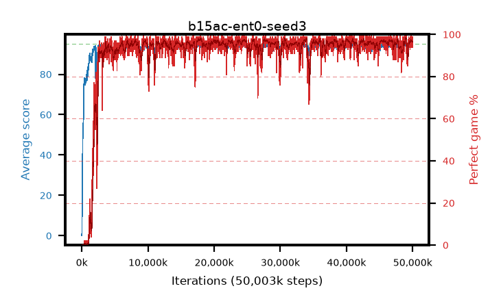

# b15ac-ent0-seed3

step **50,003,968** · 3052 evals · trailing **94.21** · peak **94.54** @48,971,776 · sef **94.5** · best30 **97.6** @17,989,632

## Config

| | |
|---|---|
| algo | ppo |
| collect_envs | 128 |
| discount | 0.99 |
| eval_interval | 16384 |
| eval_queue | True |
| eval_queue_depth | 16 |
| eval_workers | 8 |
| fc_layers | (320,) |
| graph_eval_episodes | 100 |
| max_steps | 50003968 |
| min_checkpoint_score | 40.0 |
| ppo_adam_epsilon | 1e-07 |
| ppo_anneal_fraction | 1.0 |
| ppo_clip | 0.2 |
| ppo_clip_final | None |
| ppo_entropy_coef | 0.0 |
| ppo_entropy_coef_final | None |
| ppo_epochs | 4 |
| ppo_gae_lambda | 0.98 |
| ppo_gradient_clipping | 0.5 |
| ppo_horizon | 33.6 |
| ppo_learning_rate | 0.0003 |
| ppo_learning_rate_final | None |
| ppo_minibatch | 256 |
| ppo_normalize_adv | True |
| ppo_rollout | 128 |
| ppo_target_kl | 0.0 |
| ppo_transitions_per_rollout | 16384 |
| ppo_value_loss | huber |
| ppo_vf_coef | 0.5 |
| seed | 3 |
| torch_threads | 1 |

## Evals

| step | avg score | trailing avg | min score | max score | avg reward | perfect % | epsilon |
|---|---|---|---|---|---|---|---|
| 16384 | 0.09 | 0.09 | 0.0 | 2.0 | -2.525 | 0.0 |  |
| 32768 | 1.65 | 0.87 | 0.0 | 7.0 | 1.06 | 0.0 |  |
| 49152 | 15.34 | 10.5 | 0.0 | 43.0 | 11.33 | 0.0 |  |
| ... | ... | ... | ... | ... | ... | ... | ... |
| 49823744 | 94.97 | 94.28 | 92.0 | 95.0 | 192.975 | 99.0 |  |
| 49840128 | 93.32 | 94.17 | 6.0 | 95.0 | 188.34 | 96.0 |  |
| 49856512 | 93.68 | 94.21 | 55.0 | 95.0 | 188.655 | 96.0 |  |
| 49872896 | 94.4 | 94.27 | 71.0 | 95.0 | 188.425 | 95.0 |  |
| 49889280 | 94.08 | 94.29 | 14.0 | 95.0 | 191.09 | 98.0 |  |
| 49905664 | 94.1 | 94.25 | 34.0 | 95.0 | 189.12 | 96.0 |  |
| 49922048 | 93.93 | 94.24 | 54.0 | 95.0 | 188.95 | 96.0 |  |
| 49938432 | 93.82 | 94.19 | 26.0 | 95.0 | 186.85 | 94.0 |  |
| 49954816 | 94.69 | 94.21 | 83.0 | 95.0 | 190.705 | 97.0 |  |
| 49971200 | 94.56 | 94.22 | 51.0 | 95.0 | 192.52 | 99.0 |  |
| 49987584 | 94.17 | 94.21 | 37.0 | 95.0 | 190.14 | 97.0 |  |
| 50003968 | 93.48 | 94.21 | 8.0 | 95.0 | 187.46 | 95.0 |  |
