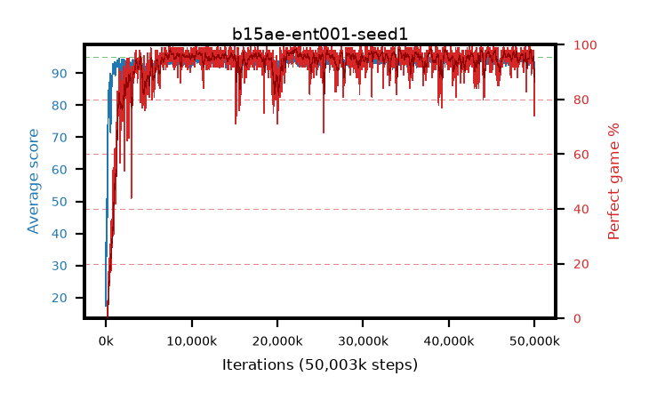

# b15ae-ent001-seed1

step **50,003,968** · 3052 evals · trailing **93.85** · peak **94.38** @22,052,864 · sef **95.3** · best30 **97.9** @22,151,168

## Config

| | |
|---|---|
| algo | ppo |
| collect_envs | 128 |
| discount | 0.99 |
| eval_interval | 16384 |
| eval_queue | True |
| eval_queue_depth | 16 |
| eval_workers | 8 |
| fc_layers | (320,) |
| graph_eval_episodes | 100 |
| max_steps | 50003968 |
| min_checkpoint_score | 40.0 |
| ppo_adam_epsilon | 1e-07 |
| ppo_anneal_fraction | 1.0 |
| ppo_clip | 0.2 |
| ppo_clip_final | None |
| ppo_entropy_coef | 0.001 |
| ppo_entropy_coef_final | None |
| ppo_epochs | 4 |
| ppo_gae_lambda | 0.98 |
| ppo_gradient_clipping | 0.5 |
| ppo_horizon | 33.6 |
| ppo_learning_rate | 0.0003 |
| ppo_learning_rate_final | None |
| ppo_minibatch | 256 |
| ppo_normalize_adv | True |
| ppo_rollout | 128 |
| ppo_target_kl | 0.0 |
| ppo_transitions_per_rollout | 16384 |
| ppo_value_loss | huber |
| ppo_vf_coef | 0.5 |
| seed | 1 |
| torch_threads | 1 |

## Evals

| step | avg score | trailing avg | min score | max score | avg reward | perfect % | epsilon |
|---|---|---|---|---|---|---|---|
| 16384 | 17.39 | 17.39 | 1.0 | 33.0 | 15.675 | 0.0 |  |
| 32768 | 50.7 | 36.78 | 3.0 | 87.0 | 46.06 | 0.0 |  |
| 49152 | 36.48 | 28.94 | 3.0 | 83.0 | 31.66 | 0.0 |  |
| ... | ... | ... | ... | ... | ... | ... | ... |
| 49823744 | 94.72 | 94.14 | 90.0 | 95.0 | 187.705 | 94.0 |  |
| 49840128 | 94.45 | 94.2 | 67.0 | 95.0 | 190.465 | 97.0 |  |
| 49856512 | 94.14 | 93.97 | 14.0 | 95.0 | 191.15 | 98.0 |  |
| 49872896 | 94.39 | 94.11 | 66.0 | 95.0 | 187.42 | 94.0 |  |
| 49889280 | 93.92 | 93.99 | 30.0 | 95.0 | 185.82 | 93.0 |  |
| 49905664 | 93.59 | 94.16 | 33.0 | 95.0 | 184.45 | 92.0 |  |
| 49922048 | 93.89 | 94.22 | 77.0 | 95.0 | 179.91 | 87.0 |  |
| 49938432 | 91.07 | 94.09 | 15.0 | 95.0 | 163.885 | 74.0 |  |
| 49954816 | 93.38 | 93.83 | 21.0 | 95.0 | 181.39 | 89.0 |  |
| 49971200 | 91.72 | 94.02 | 15.0 | 95.0 | 168.74 | 78.0 |  |
| 49987584 | 92.12 | 93.89 | 34.0 | 95.0 | 167.195 | 76.0 |  |
| 50003968 | 92.75 | 93.85 | 23.0 | 95.0 | 173.75 | 82.0 |  |
